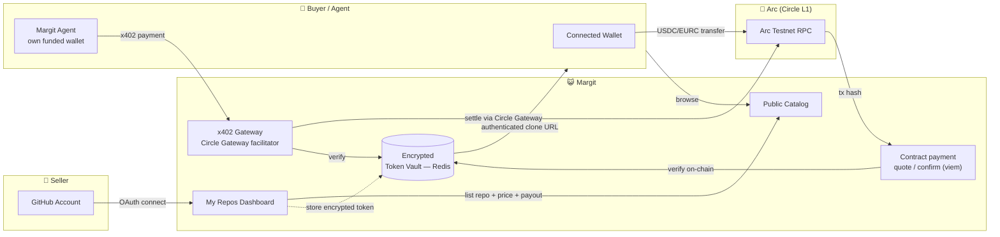
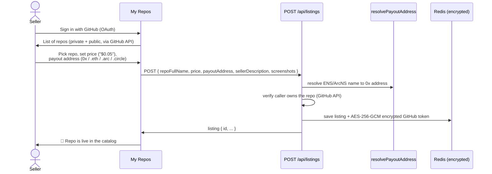
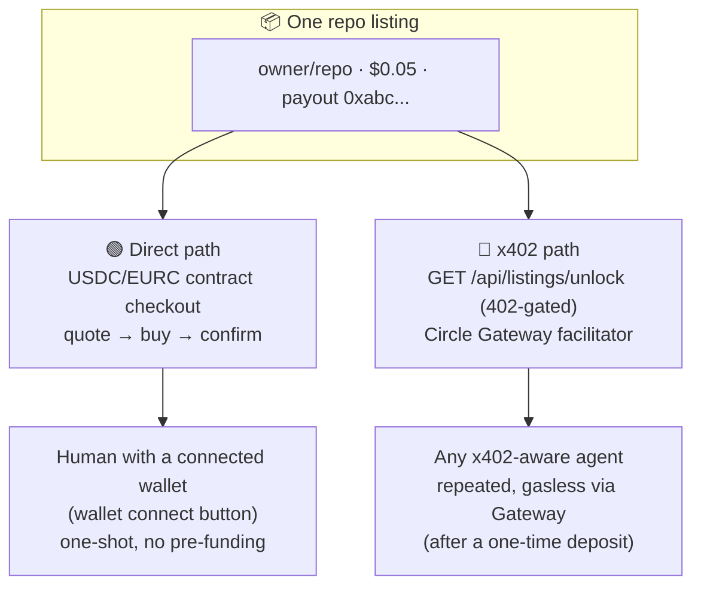
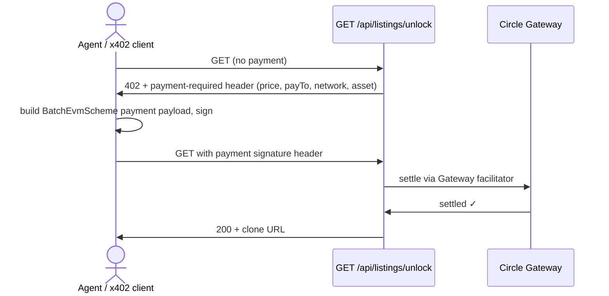
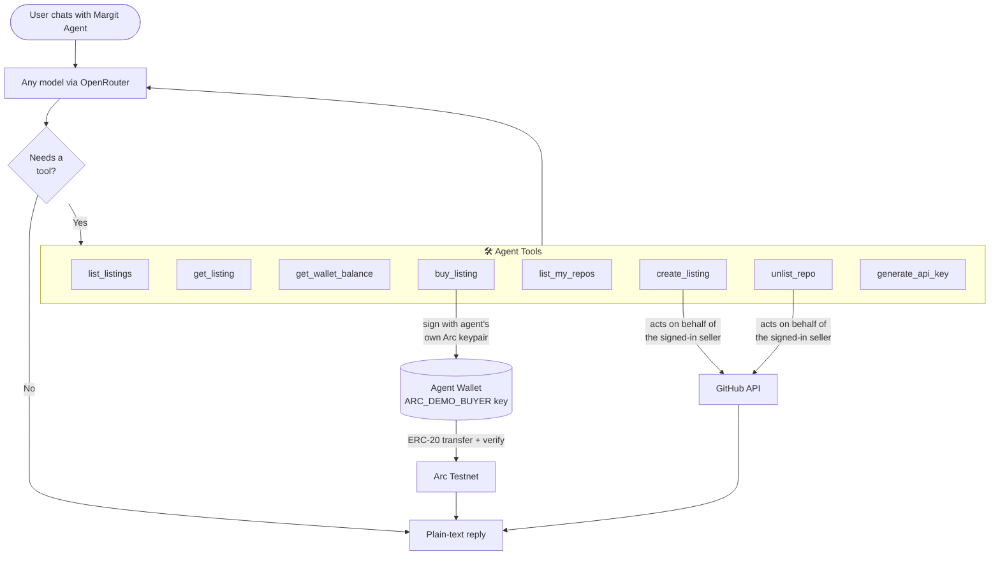
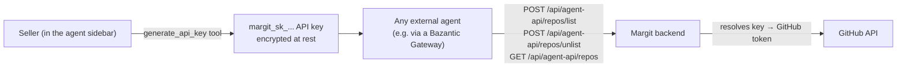
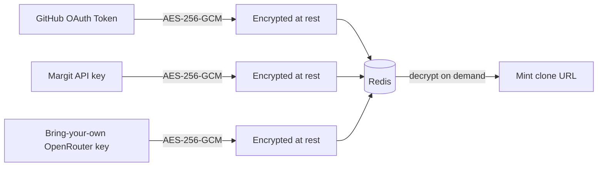

# 😺 Margit

**A marketplace for private GitHub repositories, built for humans and AI agents.**

Sell access to a private repo. Get paid in **USDC**, **EURC**, or optionally **cirBTC** on [Arc](https://arc.io) (Circle's L1). Buyers — human or AI agent — pay once and get an authenticated `git clone` URL instantly. An agent sidebar with its own funded wallet can browse, buy, list, and unlist repos on command.

## Arc Deployment

[Arc Details](arc-track/README.md) covers the architecture, payment flow, source links, and deployment status.

A live Circle Gateway x402 purchase was verified on **September 8, 2026**: **0.20 testnet USDC deposited**, **0.05 USDC paid for repository access**, and successful Git delivery (HTTP 200). Inspect the [onchain deposit](https://testnet.arcscan.app/tx/0xf4b2ccbe10bc27a8f2f563dcc2dace756775eb44546e9eafc9b105e02041386b) and [recorded payment evidence](public/proofs/circle-arc-testnet.json).

The purchase uses Circle's Nanopayments SDK with an EOA on Arc testnet. Its Gateway batch reference identifies the payment; the deposit has a separate onchain transaction hash. The recorded test covers the payment backend and repository delivery.

### Mainnet deployment status

Margit runs on Arc testnet. The mainnet deployment preparation kit is available; **mainnet deployment and application cutover are still pending**.

Run `npm run arc:readiness` for a read-only, machine-readable assessment (exit 1 means blocked). Run `npm run arc:test-release` to validate release safeguards. Once Circle confirms mainnet settings, `npm run arc:prepare-mainnet -- MANIFEST.json OUTPUT.json` checks RPC/token metadata and gas budget and prepares an unsigned deployment transaction without handling private keys or sending funds.

See the [mainnet runbook](docs/arc-mainnet-readiness.md) for configuration, immutable treasury custody, state isolation, acceptance tests and rollback. The [Arc integration overview](docs/arc-integration.md) describes the implemented payment and delivery flows. Official addresses are deliberately left blank in [the manifest template](config/arc-mainnet.example.json) until verified.


**Current checkout contract — Arc Testnet (chain ID 5042002):**
[0x72c54ecd669acb19d6e6d5b5160f67d03b4d5b7b](https://testnet.arcscan.app/address/0x72c54ecd669acb19d6e6d5b5160f67d03b4d5b7b?tab=contract)

`MargitCheckout` verifies buyer-bound quotes, pays the publisher, collects a **0.5% publisher fee**, and emits receipts indexed by **The Graph**. Native-USDC purchases take one transaction. EURC and cirBTC use approval when needed, then checkout. Admin can manage allowed tokens and transfer administration through nominee acceptance.

**One fee, two collection methods:**

| Route | Buyer pays | Publisher receives | Margit fee |
|---|---|---|---|
| Wallet / contract-buying agent tool | Listed price | 99.5% of price | Collected atomically by the contract |
| Circle Gateway x402 | Listed price | Full price through Gateway | 0.5% accrues as publisher debt, paid from My Portfolio |

On a **1 USDC** contract purchase, the publisher receives **0.995 USDC** and Margit receives **0.005 USDC**. An x402 sale of the same amount records **0.005 USDC owed**. Fees round down to token units; gas is separate. Contract fees never also become deferred debt.

My Portfolio shows gross sales, net earnings, fees collected, x402 fees accrued, paid and owed. Publishers settle x402 fees with one native-USDC transaction; the backend verifies its publisher-bound receipt and credits it once. New listings disclose the fee. Pre-launch sales remain fee-free. Deferred fees are settled by publishers. At 1.00 USDC owed, the backend blocks new x402 purchases across all of that publisher’s listings before payment. Contract checkout and previously purchased access are unaffected.

**Why deferred fees for x402?** Contract checkout collects our fee automatically. Circle x402 pays sellers directly, and we track the platform fee against their seller account for later settlement. This keeps the payment flow simple. New x402 purchases pause at 1.00 USDC in unpaid fees and resume once the balance is below that threshold. The debt belongs to the publisher, not the buyer's agent wallet; eligibility is bound to the permanent GitHub account ID, with historical usernames retained for ledger and receipt compatibility. Reputation is an incentive to settle, not a guarantee of collection.

The Circle Nanopayments SDK we integrate (`@circle-fin/x402-batching` 3.4.0) uses a single payment recipient. We found no documented native marketplace commission split in its [SDK reference](https://developers.circle.com/gateway/nanopayments/references/sdk). This is narrower than saying Circle or x402 cannot support fees: the [standard x402 seller flow](https://docs.x402.org/getting-started/quickstart-for-sellers) also specifies a recipient, while marketplace revenue allocation requires additional application or settlement logic. A buyer-authorized seller/platform split with receipts would be a useful SDK enhancement. See [fee design and alternatives](docs/fee-model.md#why-this-model-and-how-it-compares-with-other-x402-integrations).


**Admin and treasury:** `0x4d2A622F53a2ac4D3Ee1c06bCeB4641a8a6fE6aa`. The 0.5% rate and treasury are fixed for this deployment; transferring admin does not change the treasury.

[MargitArc Studio](https://thegraph.com/studio/subgraph/margit-arc) indexes purchases, automatic fee splits and deferred fee settlements. Repository delivery and access expiry remain enforced by the backend; the contract provides no code custody, delivery guarantee, escrow or refunds. x402 uses Circle Gateway settlement and does not invoke contract checkout.

See [contract and deployment details](contracts/README.md), [fee accounting](docs/fee-model.md), and [agent integration](docs/portfolio-and-agent-flow.md). Earlier test deployments are retained for historical receipts; the address above is the active contract.

---

## Table of Contents

- [Arc Deployment](#arc-deployment)
- [What is this?](#what-is-this)
- [The Big Picture](#the-big-picture)
- [How It Works](#how-it-works)
  - [1. Selling a repo](#1-selling-a-repo)
  - [2. Buying a repo — two paths](#2-buying-a-repo--two-paths)
  - [3. The agent sidebar](#3-the-agent-sidebar)
  - [4. Payout address resolution (ENS + ArcNS)](#4-payout-address-resolution-ens--arcns)
  - [5. External-agent API + Bazantic](#5-external-agent-api--bazantic)
- [Architecture](#architecture)
- [Tech Stack](#tech-stack)
- [API Reference](#api-reference)
- [Project Structure](#project-structure)
- [Getting Started](#getting-started)
- [Security Model](#security-model)
- [Known Limitations / Roadmap](#known-limitations--roadmap)

---

## What is this?

GitHub has no native way to **sell** access to a private repository. You either add someone as a collaborator (manual, free) or you don't.

Margit turns any private repo into a pay-to-clone product:

| Role | What they do |
|------|--------------|
| **Seller** | Connects GitHub, picks a private repo, sets a price + payout address, gets a live catalog listing |
| **Buyer** | Visits the listing, pays USDC or EURC on Arc, instantly receives an authenticated `git clone` URL |
| **AI Agent** | Browses the catalog via a real x402 endpoint, or chats with the built-in agent sidebar, and can pay autonomously from its own wallet |

The seller's GitHub token is encrypted at rest (AES-256-GCM). When a buyer pays, the server mints a clone URL using that token — the buyer never sees the raw credential.

---

## The Big Picture



---

## How It Works

### 1. Selling a repo

A seller authenticates with GitHub (OAuth, `repo` scope), then picks a private repository to monetize.



Sellers can also manage listings **conversationally** through the agent sidebar (`create_listing` / `unlist_repo` tools) instead of the form.

### 2. Buying a repo — two paths

Two independent payment paths exist side by side, because they serve different callers well:



**Contract path:** the backend checks delivery and signs a short-lived, buyer-bound quote. USDC buyers call `MargitCheckout.buy()` with native USDC in one transaction; EURC buyers approve the ERC-20 amount first. The server verifies the resulting `PurchaseCompleted` event before granting access. The same order cannot be paid twice; confirmation can be retried without extending access. Sellers need not remain online or submit onchain listing transactions.

**x402 path** (`BuyButton` → `GET /api/listings/unlock`): a real `402 Payment Required` challenge, settled through `@circle-fin/x402-batching`'s `BatchFacilitatorClient`/`GatewayEvmScheme` against Circle's testnet Gateway facilitator (`gateway-api-testnet.circle.com`). Requires a one-time `deposit()` into the `GatewayWallet` contract (real bundled ABI, not guessed) before the first payment. Built for agents that pay repeatedly.



Both paths mint a repository-specific `/api/access/<random-token>/repo.git` or one-time ZIP URL. GitHub credentials stay on the server. Seller-selected delivery terms determine expiry and retry behavior.

**For buyers without a CLI**: the result panel also offers a one-click **Copy clone command** and **Download ZIP** (server-proxied through `/api/access/:token/download.zip`, since GitHub's `codeload` response doesn't send CORS headers our origin can read).

### 3. The agent sidebar

A chat-driven assistant lives in a slide-in sidebar (push-layout, not an overlay), with its own funded Arc wallet, independent of any human buyer's connected wallet.



**Model choice is not hardcoded to one vendor.** The backend talks to [OpenRouter](https://openrouter.ai) (one OpenAI-compatible API proxying Anthropic, OpenAI, Google, and free community models). Default is OpenRouter's own `openrouter/free` auto-router — a shared key configured by the site owner (`OPENROUTER_API_KEY`) means every visitor can try the agent with zero setup. Anyone can override the model or bring their own OpenRouter key in the sidebar's **Settings** panel (gear icon) — stored encrypted per-visitor, same as GitHub tokens.

**Voice input**: a mic button next to the chat box uses the browser's native `SpeechRecognition` API (feature-detected, no server round-trip, no extra dependency).

**Live UI sync**: when the agent lists/unlists a repo, the result is reported back through the chat response (`listingChange`), so "My Repos" updates immediately and briefly flashes the affected card — no manual refresh needed.

### 4. Payout address resolution (ENS + ArcNS)

Sellers can enter a payout address as a raw `0x...`, an ENS `.eth` name (resolved via `viem`'s `getEnsAddress` against mainnet), or an ArcNS `.arc`/`.circle` name (a community Arc-testnet naming service, resolved via its REST API). The same resolver runs both directions — reverse lookup (`resolveArcNsReverse`) shows a connected wallet's or listing's ArcNS name instead of a raw address wherever one exists (nav wallet menu, listing management panel).

### 5. External-agent API + Bazantic

Buyer-side browsing (`/api/listings`, `/api/listings/unlock`) is already public and needs no new plumbing to expose to a third-party agent framework. Seller-side actions (list/unlist) needed a new auth path, since only the browser session cookie could authorize them before:



Margit now exposes a working **Streamable HTTP MCP server at `/api/mcp`** with seven tools: `browse_catalog`, `get_listing`, `create_checkout_quote`, `confirm_checkout`, `list_my_repos`, `create_listing`, and `unlist_repo`. Its `margit://skill` resource explains the workflows. Public tools need no key; seller tools use `Authorization: Bearer MARGIT_API_KEY` and reuse the existing seller ownership checks. The server never signs or broadcasts payments.

Open **`/agents`** from the homepage to test the MCP connection, read **`/SKILLS.md`** or **`/skills/margit/SKILL.md`**, and inspect **`/api/agent-docs`**. `/api/agent-docs/checkout-abi` exposes the checkout ABI. The native Arc USDC payment value is the six-decimal order amount multiplied by `10^12`; ERC-20 checkout attaches zero native value.

Use `npm run mcp:check -- http://localhost:5173` (or your deployed origin) to run an official MCP client against initialization, tools/list, resources/read, and the real catalog. This check never buys or changes a listing. Run `node --import tsx --test server/tests/mcp.test.ts` for isolated protocol and credential tests.

[Bazantic’s live OpenAPI](https://api.bazantic.com/openapi.json), checked September 8, 2026, accepts gateways with `service_protocol: "mcp"`. **`/api/agent-docs/bazantic`** provides the verified registration steps and draft payload. Registration needs a public HTTPS endpoint, Bazantic `account_id`, and a valid API key with the write role. The gateway slug is assigned by Bazantic, not the caller. Recipes require the admin role, reference that returned slug, and have a separate publish step. No gateway or recipe has been registered by this change. Never publish a seller’s Margit key as a shared public gateway credential.

---

## Architecture

```mermaid
flowchart TB
    subgraph Client["🖥️ Browser (Vite + React 19)"]
        Pages["Pages: /catalog, /profile,<br/>/repo/:owner/:name, /publisher/:login"]
        Landing["/ — static ported homepage<br/>(public/landing/index.html)"]
        Sidebar["AgentSidebar — chat + settings + voice"]
        WalletSDK["Wallet SDK — connect modal, wallet details modal"]
    end

    subgraph Server["⚙️ Hono API (Node, tsx)"]
        Auth["/api/auth/* — GitHub OAuth"]
        Repos["/api/repos* — GitHub proxy"]
        Listings["/api/listings* — CRUD + unlock (x402)"]
        Verify["/api/checkout/quote + confirm — contract path"]
        AgentChat["/api/agent/* — chat, wallet, settings, models"]
        AgentApi["/api/agent-api/* — API-key auth, external agents"]
        Names["/api/resolve-name, /api/resolve-address"]
        Zip["/api/download-zip"]
    end

    subgraph Libs["📚 server/src/"]
        PaymentsLib["payments.ts — Arc chain def, direct verify"]
        GatewayLib["x402-gateway.ts — Circle Gateway facilitator"]
        AgentLib["agent.ts — OpenRouter loop, tools, own wallet"]
        NamesLib["names.ts — ENS + ArcNS resolution"]
        CryptoLib["crypto.ts — AES-256-GCM"]
        ApiKeysLib["api-keys.ts — margit API keys"]
    end

    subgraph External["🌐 External"]
        GitHubAPI["GitHub API"]
        ArcRPC["Arc Testnet RPC"]
        CircleGW["Circle Gateway facilitator"]
        OpenRouterAPI["OpenRouter"]
        Redis["Upstash Redis"]
    end

    Pages --> WalletSDK
    Pages -->|fetch| Server
    Sidebar -->|fetch| AgentChat
    Server --> Libs
    Auth --> GitHubAPI
    Repos --> GitHubAPI
    Verify --> PaymentsLib --> ArcRPC
    Listings --> GatewayLib --> CircleGW
    AgentChat --> AgentLib --> OpenRouterAPI
    AgentLib --> ArcRPC
    AgentApi --> ApiKeysLib
    Names --> NamesLib
    Libs --> Redis
    Libs --> CryptoLib
```



**State persistence:** Upstash Redis (REST API) for everything — sessions, OAuth CSRF state, listings, encrypted GitHub tokens, agent chat history, per-visitor agent settings, margit API keys. No SQL database.

---

## Tech Stack

| Layer | Technology |
|-------|------------|
| Build tool | Vite 8 (Rolldown-based) |
| UI | React 19, TypeScript |
| Backend framework | Hono (`@hono/node-server`), `tsx watch` |
| Chain | Arc — Circle's L1, testnet chain ID `5042002`, native-gas-as-USDC |
| Payments (wallet/agent) | MargitCheckout receipts on Arc, verified server-side via `viem` |
| Payments (agentic) | x402 standard (`@x402/core`, `@x402/hono`) + `@circle-fin/x402-batching` (Circle Gateway) |
| Wallet connect | Wallet SDK (connect modal, wallet details modal) |
| Naming | ENS (`.eth`, via `viem`) + ArcNS (`.arc`/`.circle`, community REST API) |
| Agent LLM | OpenRouter (`openai` SDK pointed at `openrouter.ai/api/v1`) — any model, default `openrouter/free` |
| Voice input | Web Speech API (browser-native, no dependency) |
| Token/key encryption | AES-256-GCM (Node `crypto`) |
| Storage | Upstash Redis (REST API) |
| Auth | GitHub OAuth (custom, not a library) |

---

## API Reference

| Endpoint | Method | Auth | Purpose |
|----------|--------|------|---------|
| `/api/auth/github/login` | GET | — | Start GitHub OAuth |
| `/api/auth/github/callback` | GET | — | OAuth callback, creates session |
| `/api/auth/logout` | POST | Session | Destroy session |
| `/api/auth/revoke` | POST | Session | Revoke the GitHub OAuth grant entirely |
| `/api/me` | GET | Session | Current user |
| `/api/repos` | GET | Session | List the signed-in user's GitHub repos |
| `/api/repos/make-private` | POST | Session | Convert a public repo to private |
| `/api/listings` | GET | Public | Browse the catalog |
| `/api/listings` | POST | Session | Create a listing (price, payout, description, screenshots) |
| `/api/listings/:id` | DELETE | Session | Unlist |
| `/api/listings/unlock` | GET | x402 (402-gated) | Agentic buy path — Circle Gateway settlement |
| `/api/checkout/quote` | POST | Buyer address | Validate delivery and issue buyer-bound quote |
| `/api/checkout/confirm` | POST | Private claim secret + tx hash | Verify receipt and recover original access |
| `/api/portfolio` | GET | Wallet signature / GitHub / operator session | Purchases, sales and Graph indexing status |
| `/api/download-zip` | POST | Public (clone URL) | Server-proxied ZIP download (no CORS) |
| `/api/resolve-name` | GET | Public | ENS/ArcNS name → 0x address |
| `/api/resolve-address` | GET | Public | 0x address → ArcNS name (reverse) |
| `/api/keys` | POST | Session | Issue a margit API key |
| `/api/agent-api/repos` | GET | API key | List a seller's repos (external-agent surface) |
| `/api/agent-api/repos/list` | POST | API key | List a repo for sale (external-agent surface) |
| `/api/agent-api/repos/unlist` | POST | API key | Unlist a repo (external-agent surface) |
| `/api/agent/chat` | POST | Anonymous cookie | Agent sidebar conversation turn |
| `/api/agent/wallet` | GET | Public | Agent's own Arc wallet balance |
| `/api/agent/settings` | GET/POST | Anonymous cookie | Per-visitor model + API key |
| `/api/agent/models` | GET | Public | Live OpenRouter model catalog (tool-calling capable) |

---

## Project Structure

```
margit/
├── src/
│   ├── App.tsx                  # Entire frontend — pages, NavBar, AgentSidebar, all components
│   ├── App.css                  # All app styling
│   ├── api.ts                   # Typed fetch wrappers for every backend route
│   ├── speech.d.ts              # Ambient types for the Web Speech API
│   └── lib/thirdweb.ts          # Wallet client, chain, wallet list, theme
├── server/src/
│   ├── index.ts                 # All Hono routes
│   ├── agent.ts                 # OpenRouter tool-use loop, agent wallet, settings, model catalog
│   ├── api-keys.ts              # Margit API keys (external-agent auth)
│   ├── payments.ts              # Arc chain def, direct-payment verification
│   ├── x402-gateway.ts          # Circle Gateway facilitator registration
│   ├── listings.ts              # Listing CRUD (Redis)
│   ├── names.ts                 # ENS + ArcNS resolution
│   ├── session.ts                # GitHub OAuth session (Redis)
│   ├── oauth-state.ts           # OAuth CSRF state (Redis)
│   ├── crypto.ts                # AES-256-GCM encrypt/decrypt
│   └── redis.ts                 # Upstash Redis client
├── public/landing/               # Ported static marketing homepage (served at "/" via a dev-only
│                                  # Vite middleware plugin — see vite.config.ts)
├── portfolio-html-template/      # Reference HTML template the homepage was ported from (gitignored)
└── vite.config.ts               # Dev server config + landing-page middleware
```

---

## Getting Started

### Prerequisites

- Node.js + npm
- A [GitHub OAuth App](https://github.com/settings/developers)
- An [Upstash Redis](https://console.upstash.com) database (free tier is fine)
- Two Arc-testnet wallets, funded via [faucet.circle.com](https://faucet.circle.com) ("Arc Testnet") — one to receive payments, one for the agent sidebar's own funded wallet
- A free [OpenRouter](https://openrouter.ai/keys) API key (optional but recommended — powers the agent for every visitor)
- A [wallet SDK client ID](https://thirdweb.com/dashboard) (free)

### Setup

```bash
npm install
cp .env.example .env
# Fill in the values — see comments in .env.example for where to get each one
```

### Run

```bash
npm run dev      # starts both the Vite dev server (5173) and the Hono API (8788)
```

Visit `http://localhost:5173`.

### Build

```bash
npm run build
```

> Note: the static homepage (`public/landing/index.html`) is currently only served at `/` via a **dev-only** Vite middleware plugin (`vite.config.ts`). Production serving of `/` isn't wired up yet — see [Known Limitations](#known-limitations--roadmap).

---

## Security Model



- **GitHub tokens** encrypted with AES-256-GCM before storage; the key lives only in `TOKEN_ENCRYPTION_KEY`.
- **Access URLs** contain repository-specific bearer grants, never the seller GitHub token. Grants expire and enforce the purchased delivery policy.
- **Contract order IDs are single-use onchain**. Receipt recovery is idempotent and never resets delivery expiry or download consumption.
- **Wallet keys never touch the server for human buyers** — the wallet SDK only ever handles signing in-browser.
- **The agent's own wallet key** (`ARC_DEMO_BUYER_PRIVATE_KEY`) is a real private key held server-side — fund it only with what you're willing to let the agent spend.
- **Bring-your-own OpenRouter keys and margit API keys** are encrypted at rest the same way GitHub tokens are.
- **Payments are verified independently on-chain** (contract path via `viem` receipt decode; x402 path via the Circle Gateway facilitator) — the server never trusts a client's claim that it paid.

---

## Known Limitations / Roadmap

- **Reviews/ratings are UI placeholders only** (`StarRating`, `ReviewsSection`) — intentionally honest "not built yet" rather than fake data. Planned basis: ERC-8004 (Trustless Agents — Identity/Reputation/Validation registries).
- **The Graph**: receipt schema/mapping and Studio deployment scripts are implemented for MargitArc. Configure the deployed query endpoint to enable portfolio enrichment; x402 Gateway is not indexed by this contract subgraph.
- **Bazantic**: `/api/agent-api/*` exists as the intended wrap target, but no Gateway/Recipe has been registered yet — blocked on a real Bazantic API key (the JWT currently in `.env` doesn't authenticate against `api.bazantic.com`).
- **Production deployment**: Vercel serves the Vite build and Hono API through `vercel.json`. See [Vercel setup](docs/vercel-deployment.md) for environment configuration.
- **Landing page leftover content**: the mid-body "demo showcase" sections (ported from the source HTML template) still contain unrelated template-vendor marketing copy and dead links to pages that were never copied over — nav, footer, hero, and header CTAs are all real and wired to margit routes; the deep body content is a separate, larger content-authoring pass.
- **Network scope**: this implementation targets Arc Testnet only; mainnet deployment is out of scope.

---

<div align="center">

**Built for ETHGlobal ETHOnline 2026** · USDC + EURC on Arc · agent-native by design

</div>

### Checkout currency conversion

Listing prices are in USD. The wallet button shows the actual token amount: USDC uses the USD amount; EURC uses the latest daily USD/EUR ECB reference rate via [Frankfurter](https://frankfurter.dev/). This assumes each stablecoin tracks its named currency; it is not a token-market swap quote. Rates are cached for an hour and rejected when more than seven days old. If conversion is unavailable, EURC checkout is blocked while USDC remains available.

Converted amounts are rounded to six token decimals and shown with at least two decimals. The signed checkout order locks the payable amount for five minutes. If a fresh order differs from the amount displayed, the wallet flow stops before approval/payment and refreshes the price for review. Purchase history and fees use the amount actually paid in the selected token. x402 remains USDC-denominated.


### Seller access and optional cirBTC

In the listing editor’s Access tab, choose timed clone/ZIP access, one-time ZIP, or permanent access. Permanent grants have no expiry or download limit and return `expiresAt: null`. They serve the repository’s current source, including updates, while the seller keeps the repository connected and Margit remains available; they are not archived snapshots. Existing purchases and signed quotes retain their original access terms after listing edits.

The **Accepted currencies** cards keep USDC selected and locked. EURC is preselected and optional, and cirBTC is optional. The API rejects quotes and price requests for currencies the seller has disabled. x402 requires USDC and is blocked before settlement on older listings that do not accept it. Legacy listings and pending quotes retain their original currency terms. cirBTC prices use the [Coinbase BTC/USD spot reference](https://docs.cdp.coinbase.com/coinbase-business/track-apis/prices), cached for 30 seconds, assuming one cirBTC tracks one BTC. This is a reference conversion, not a swap. Quotes round to the nearest satoshi; amounts that round to zero satoshis are rejected. The browser preloads conversions and verifies that the signed amount matches the displayed amount before requesting payment.

The [Circle Arc testnet cirBTC contract](https://developers.circle.com/assets/cirbtc-contract-addresses) is `0xf0C4a4CE82A5746AbAAd9425360Ab04fbBA432BF` (8 decimals). Checkout must allowlist it using `setAllowedToken` before quoting cirBTC; payments, fees and portfolio history retain eight-decimal precision. The existing 0.5% fee rounds down in token base units.

Run `node --env-file=.env --import tsx scripts/enable-cirbtc.ts` for an admin preflight, then add `--enable` to apply it. The script verifies chain, admin and decimals and saves the confirmed public transaction in `contracts/cirbtc.arc-testnet.json`.

## Circle nanopayments in the built-in agent

The shopping agent now includes an chat-requested x402 purchase tool using Circle's `GatewayClient` on Arc testnet. Clickable prompts help users discover repositories, inspect Gateway funding, and request a purchase. Successful payments show Circle SDK evidence and an explorer link when an actual transaction hash is returned.

A live 0.05 USDC repository purchase and successful Git delivery were verified on September 8, 2026. See [the demo guide, architecture, limits, and evidence](docs/circle-agent-demo.md). The signer is a demo EOA; this does not claim Circle-managed Agent Wallets or production readiness.
