# 😺 Margit

**A marketplace for private GitHub repositories, built for humans and AI agents.**

Sell access to a private repo. Get paid in **USDC**, **EURC**, or optionally **cirBTC** on [Arc](https://arc.io) (Circle's L1). Buyers can be human or AI agent and they pay once and get an authenticated `git clone` URL instantly. An agent sidebar with its own funded wallet can browse, buy, list, and unlist repos on command.

## Table of Contents

- [What is this?](#what-is-this)
- [The Big Picture](#the-big-picture)
- [How It Works](#how-it-works)
  - [1. Selling a repo](#1-selling-a-repo)
  - [2. Buying a repo: two paths](#2-buying-a-repo--two-paths)
  - [3. The agent sidebar](#3-the-agent-sidebar)
  - [4. Payout address resolution (ENS + ArcNS)](#4-payout-address-resolution-ens--arcns)
  - [5. External-agent API + Bazantic](#5-external-agent-api--bazantic)
- [Agent wallet options and Circle payments](#agent-wallet-options-and-circle-payments)
  - [Circle Gateway and x402 nanopayments](#circle-gateway-and-x402-nanopayments)
  - [1Claw purchasing wallet](#1claw-purchasing-wallet)
  - [Checkout currency conversion](#checkout-currency-conversion)
- [Applied tracks: Arc, The Graph, and Bazantic](#applied-tracks-arc-the-graph-and-bazantic)
  - [1. Arc: pay for repository access](#1-arc-pay-for-repository-access)
  - [2. The Graph: discover activity backed by receipts](#2-the-graph-discover-activity-backed-by-receipts)
  - [3. Bazantic: compare repositories before buying](#3-bazantic-compare-repositories-before-buying)
- [Arc Deployment](#arc-deployment)
  - [Mainnet deployment status](#mainnet-deployment-status)
- [Verify The Graph integration](#verify-the-graph-integration)
  - [Where the indexed data is used](#where-the-indexed-data-is-used)
  - [Reviewer walkthrough](#reviewer-walkthrough)
- [Published Bazantic Recipe: Margit Repository Advisor](#published-bazantic-recipe-margit-repository-advisor)
- [Developer resources](#developer-resources)
- [API Reference](#api-reference)
- [Project Structure](#project-structure)
- [Security Model](#security-model)

---

## What is this?

GitHub has no native way to **sell** access to a private repository. You either add someone as a collaborator (manual, free) or you don't.

Margit turns any private repo into a pay-to-clone product:

| Role | What they do |
|------|--------------|
| **Seller** | Connects GitHub, picks a private repo, sets a price + payout address, gets a live catalog listing |
| **Buyer** | Visits the listing, pays USDC or EURC on Arc, instantly receives an authenticated `git clone` URL |
| **AI Agent** | Browses the catalog via a real x402 endpoint, or chats with the built-in agent sidebar, and can pay autonomously from its own wallet |

The seller's GitHub token is encrypted at rest (AES-256-GCM). When a buyer pays, the server mints a clone URL using that token — the buyer never sees the raw credential.

---

## The Big Picture

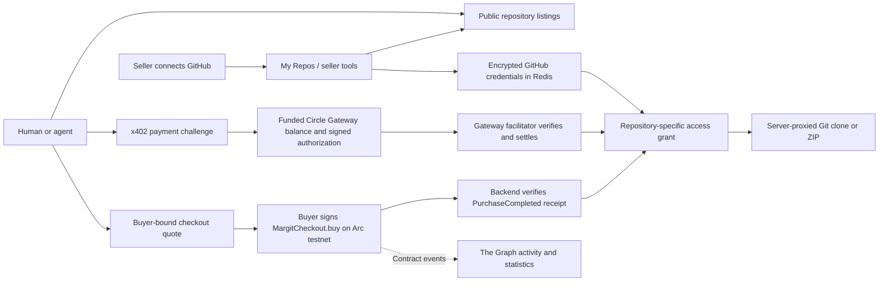

---

## How It Works

### 1. Selling a repo

A seller authenticates with GitHub (OAuth, `repo` scope), then picks a private repository to monetize.

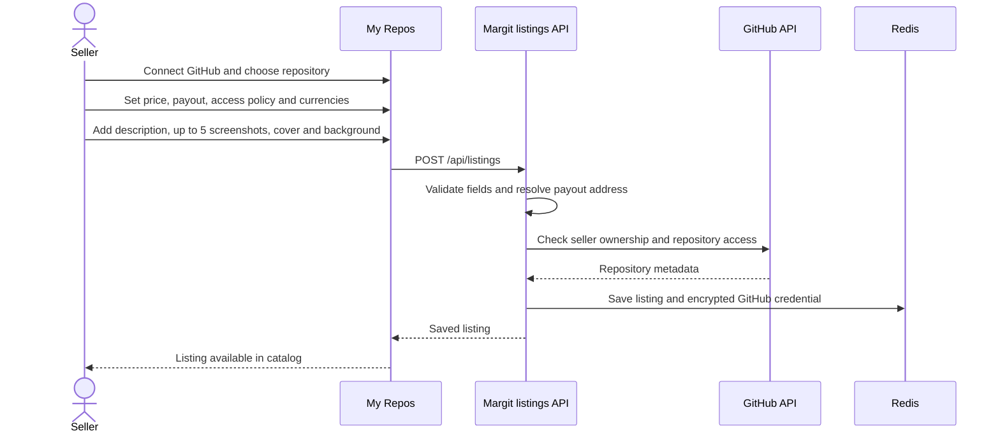

Sellers can also manage listings **conversationally** through the agent sidebar (`create_listing` / `unlist_repo` tools) instead of the form.

### 2. Buying a repo: two paths

Two independent payment paths exist side by side, because they serve different callers well:

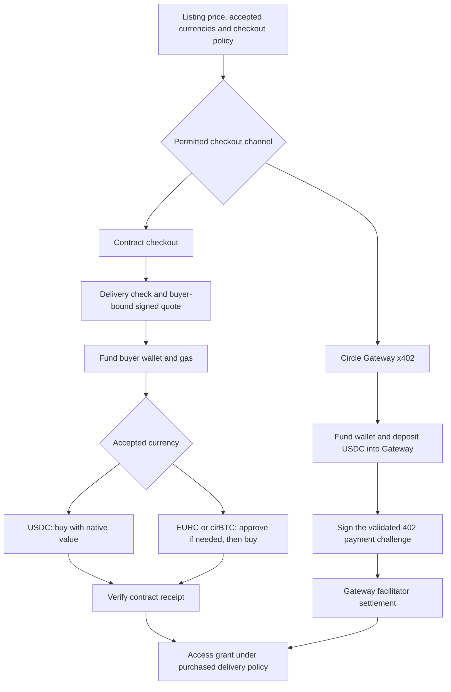

**Contract path:** humans and agents can use it when the listing allows wallet checkout. The backend checks delivery and signs a five-minute, buyer-bound quote. USDC buyers call `MargitCheckout.buy()` with native USDC; EURC and optional cirBTC buyers approve the ERC-20 amount first if needed. The buyer needs funds and gas in the purchasing wallet; no Gateway deposit is required. The server verifies the resulting `PurchaseCompleted` event before granting access. The same order cannot be paid twice; confirmation can be retried without extending access. Sellers need not remain online or submit onchain listing transactions.

**x402 path** (`buy_listing_x402` or an external x402 client → `GET /api/listings/unlock`): a real `402 Payment Required` challenge, settled through `@circle-fin/x402-batching`'s `BatchFacilitatorClient`/`GatewayEvmScheme` against Circle's testnet Gateway facilitator (`gateway-api-testnet.circle.com`). Requires enough USDC deposited into the `GatewayWallet` contract before paying; top up that separate balance as needed. Built for agents that pay repeatedly.

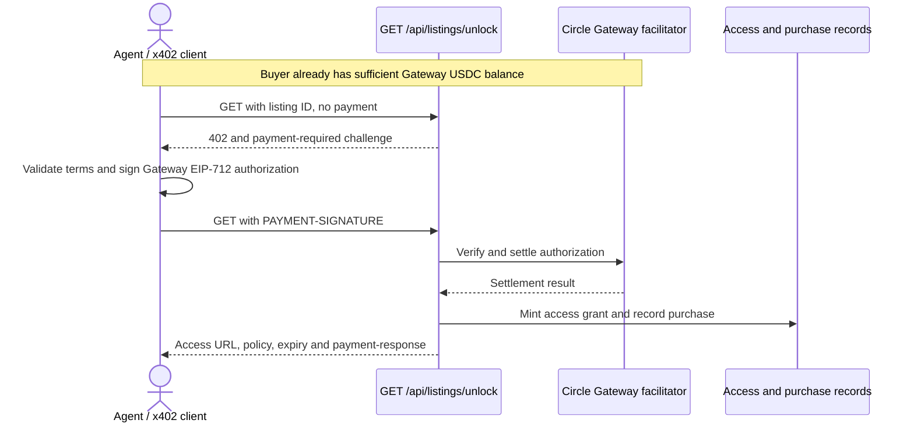

Both paths return a repository-specific `/api/access/<random-token>/repo.git` or one-time ZIP URL. GitHub credentials stay on the server. Seller-selected delivery terms determine expiry and retry behavior.

**For buyers without a CLI**: the result panel also offers a one-click **Copy clone command** and **Download ZIP** (server-proxied through `/api/access/:token/download.zip`, since GitHub's `codeload` response doesn't send CORS headers our origin can read).

### 3. The agent sidebar

Open **Agent**, then click the **⋮** menu beside the wallet address:

- **Search options** — enable the Bazantic repository advisor.
- **Circle Gateway** — view Gateway information.
- **Agent Settings** — choose or connect the agent's purchasing wallet.
- **AI Model Settings** — choose a model or supply your OpenRouter key.
- **Clear Chat** — start a fresh conversation.

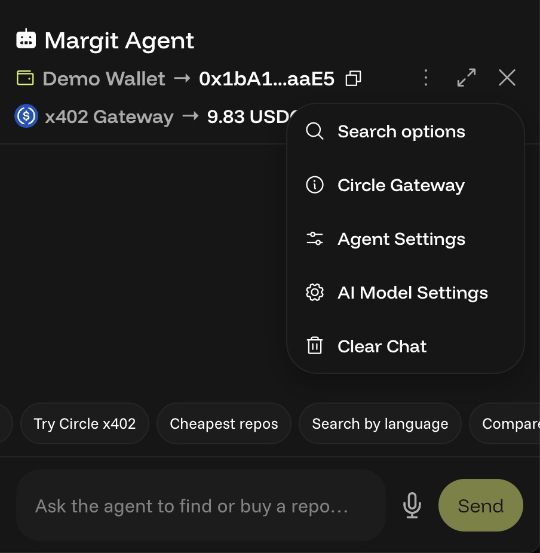

A chat-driven assistant lives in a slide-in sidebar, using the selected demo, personal, Circle-managed, or 1Claw wallet, independently of the human buyer’s connected browser wallet. Circle-managed wallets use x402; demo/personal EOAs and the 1Claw adapter also support contract checkout.

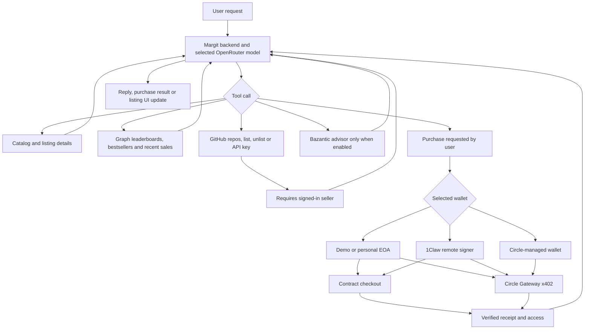

**Choose your AI model.** The backend uses [OpenRouter](https://openrouter.ai), which provides access to Anthropic, OpenAI, Google, and free community models through one API. The default is OpenRouter's `openrouter/free` auto-router. A shared key configured by the site owner (`OPENROUTER_API_KEY`) lets visitors try the agent without setup. Open **⋮ → AI Model Settings** to choose another model or supply your own OpenRouter key. Personal keys are stored encrypted per visitor, just like GitHub tokens.

**Voice input**: a mic button next to the chat box uses the browser's native `SpeechRecognition` API (feature-detected, no server round-trip, no extra dependency).

**Live UI sync**: when the agent lists/unlists a repo, the result is reported back through the chat response (`listingChange`), so "My Repos" updates immediately and briefly flashes the affected card.

### 4. Payout address resolution (ENS + ArcNS)

Sellers can enter a payout address as a raw `0x...`, an ENS `.eth` name (resolved via `viem`'s `getEnsAddress` against mainnet), or an ArcNS `.arc`/`.circle` name (a community Arc-testnet naming service, resolved via its REST API). Reverse lookup (`resolveArcNsReverse`) displays a connected wallet's or listing's ArcNS name when available. These names appear in the navigation wallet menu and listing management panel.

### 5. External-agent API + Bazantic

Buyer-side browsing (`/api/listings`, `/api/listings/unlock`) is already public and needs no new plumbing to expose to a third-party agent framework. Seller-side actions (list/unlist) needed a new auth path, since only the browser session cookie could authorize them before:

**Authenticated seller actions**

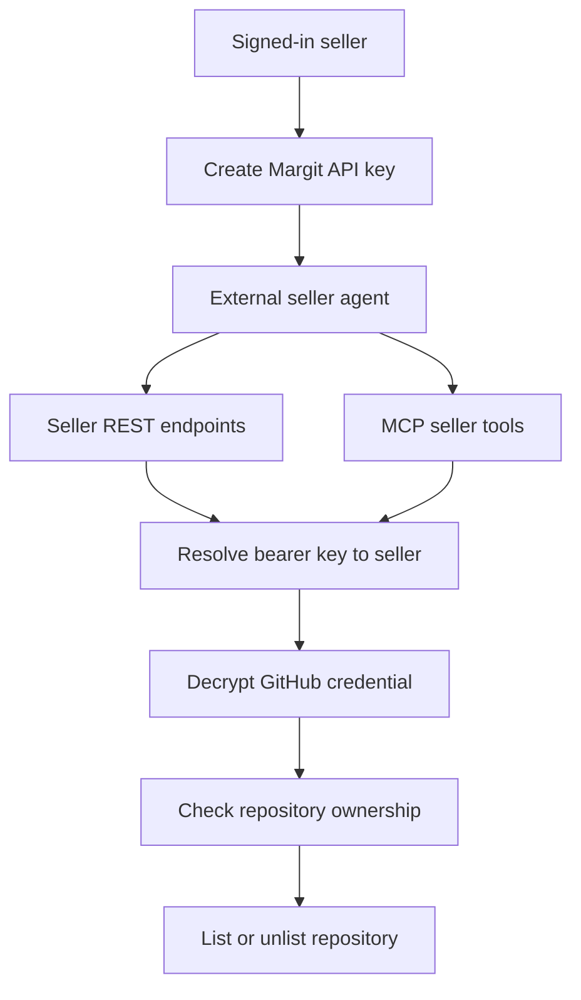

**Public discovery and Bazantic**

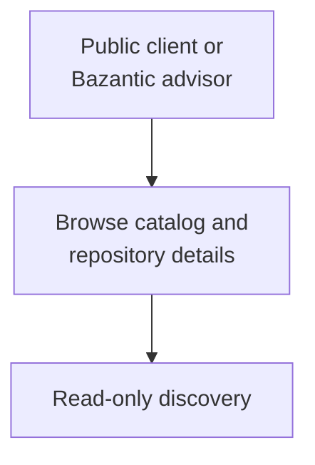

Margit now exposes a working **Streamable HTTP MCP server at `/api/mcp`** with seven tools: `browse_catalog`, `get_listing`, `create_checkout_quote`, `confirm_checkout`, `list_my_repos`, `create_listing`, and `unlist_repo`. Its [margit://skill](https://margit.sh/skills/margit/SKILL.md) MCP resource explains the workflows. Public tools need no key; seller tools use `Authorization: Bearer MARGIT_API_KEY` and reuse the existing seller ownership checks. The server never signs or broadcasts payments.

Open [/agents](https://margit.sh/agents) from the homepage to test the MCP connection, read [/SKILLS.md](https://margit.sh/SKILLS.md) or [/skills/margit/SKILL.md](https://margit.sh/skills/margit/SKILL.md), and inspect [/api/agent-docs](https://api.margit.sh/api/agent-docs). [/api/agent-docs/checkout-abi](https://api.margit.sh/api/agent-docs/checkout-abi) exposes the checkout ABI. The native Arc USDC payment value is the six-decimal order amount multiplied by `10^12`; ERC-20 checkout attaches zero native value.

Use `npm run mcp:check -- http://localhost:5173` (or your deployed origin) to run an official MCP client against initialization, tools/list, resources/read, and the real catalog. This check never buys or changes a listing. Run `node --import tsx --test server/tests/mcp.test.ts` for isolated protocol and credential tests.

The published Bazantic integration uses two REST gateways: Margit's public API and GitHub's public repository API. Bazantic exposes their generated MCP tools to **Margit Repository Advisor**. The Recipe binds only `browse_catalog`, `github_get_repository`, `github_get_languages`, and `github_list_releases`.

Seller mutations and checkout tools are not bound. See the [integration guide](bazantic-track/README.md) for deployed identifiers, scope and evidence. `/api/agent-docs/bazantic` retains earlier registration guidance; the deployed dashboard configuration documented in that guide is the reference for this Recipe.

---

## Agent wallet options and Circle payments

Margit has one built-in marketplace agent with **four options in Agent Settings**. These options change wallet custody and connection setup, not the AI model. The agent can discover repos, explain listings, query Graph-backed rankings, and perform supported marketplace actions. Seller actions require the relevant GitHub authorization.

| Option | Focus | Setup and custody | Current payment support |
| --- | --- | --- | --- |
| **Demo Wallet** | Try the complete Circle x402 buying flow quickly | Shared, preconfigured Arc testnet EOA; its wallet and Gateway funds are shared across demo users | Circle Gateway USDC purchases; demo contract-checkout tooling also exists |
| **My Agent Wallet** | Use separately funded agent funds tied to this browser | Margit generates a key, stores it encrypted on the backend, and associates it with the browser session; this is not a browser-extension wallet | Circle Gateway USDC purchases using this wallet's funds |
| **Circle Agent Wallet** | Connect a Circle-managed wallet through email verification | Accept Circle's terms, request an email code, and connect. Margit stores the Circle session encrypted and uses Circle tooling for signing | Implemented Gateway funding, balance and x402 purchase flow; live Circle login/purchase verification remains pending |
| **1Claw Agent Wallet** | Use an external signer for Arc purchases and Gateway deposits | Supply a 1Claw agent ID, agent API key and Ethereum signing address | Active purchasing wallet for Arc contract checkout and Circle Gateway x402 |

For Demo and My Agent Wallet, preview the address and token balances, then click **Confirm** to switch. Circle has its own email connection flow. Selecting 1Claw opens its connection form; **Connect and select wallet** verifies the signer, stores credentials encrypted with consent, and makes it the active purchasing wallet. AI model/provider settings are separate.

### Circle Gateway and x402 nanopayments

Circle is the agent's USDC payment path on **Arc testnet**. The EOA flow uses `@circle-fin/x402-batching` and its `GatewayClient`; the Circle-managed flow uses Circle wallet/Gateway commands and remote signing. The agent requests a paid repository resource, satisfies its x402 payment requirements, and receives authenticated repository access after payment is accepted. Successful purchases include payment evidence; blockchain explorer links appear when a transaction hash is available.

**Wallet balance and Gateway balance are separate.** Funding the wallet does not automatically fund Gateway. Use **Add to x402 Gateway** to deposit an explicit USDC amount, leaving funds for gas. x402 purchases consume the selected wallet's available Gateway funds, so its ordinary wallet balance may not decrease for every purchase.

- The sidebar displays **x402 Gateway → … USDC**, with two decimals and a refresh control.
- Hover the wallet name to inspect token balances. The address opens that wallet on Arcscan.
- Click the Gateway amount to inspect a fresh, address-specific Circle API balance response, including its source request and timestamp. Margit relays this response; the displayed request can be repeated directly against Circle for independent verification. The shared Gateway contract's total balance is not a user's available balance.
- A Circle-managed wallet can have a separate backing EOA for Gateway signing. Treat wallet and payment-account addresses as distinct when inspecting evidence.
- Contract-checkout sales power our Graph statistics. **Circle Gateway x402 purchases are not included in that subgraph.**

A live **0.05 USDC** repository purchase and successful Git delivery were verified with the demo wallet through Circle Gateway. See the [Circle demo guide and evidence](docs/circle-agent-demo.md), [payment implementation](server/src/circle-payment.ts), [Circle-managed integration](server/src/circle-managed.ts), and [wallet selection](server/src/agent-wallet.ts).

Try **Check balance**, **Try Circle x402**, or **Buy this repo** on a repository page. Discovery also includes **Bestselling repos**, **Top buyers**, **Top sellers**, and **Weekly statistics**, backed by the [Leaderboards API](server/src/graph.ts). Catalog prompts focus on discovery and buying; My Repos prompts prioritize listing management.

### 1Claw purchasing wallet

Open **Agent Settings → 1Claw Agent Wallet → Connect and select wallet**. Supply the agent ID, agent API key (`ocv_`), and its EVM signing address. Authorize encrypted credential storage for your requested purchases and deposits. The private key stays with 1Claw.

The integration supports Arc contract checkout and Circle Gateway x402, including Gateway deposits. It verifies returned signatures and transaction fields before use. See [setup, permissions, code references, and verification status](docs/oneclaw-wallet.md). Automated tests use a synthetic signer; a live funded 1Claw checkout has not yet been verified.


### Checkout currency conversion

Listing prices are in USD. The wallet button shows the actual token amount: USDC uses the USD amount; EURC uses the latest daily USD/EUR ECB reference rate via [Frankfurter](https://frankfurter.dev/). This assumes each stablecoin tracks its named currency; it is not a token-market swap quote. Rates are cached for an hour and rejected when more than seven days old. If conversion is unavailable, EURC checkout is blocked while USDC remains available.

cirBTC is also available when enabled by the seller.

Converted amounts use six token decimals for USDC/EURC and eight for cirBTC, and are shown with at least two decimals. The signed checkout order locks the payable amount for five minutes. If a fresh order differs from the amount displayed, the wallet flow stops before approval/payment and refreshes the price for review. Purchase history and fees use the amount actually paid in the selected token. x402 remains USDC-denominated.


---

## Applied tracks: Arc, The Graph, and Bazantic

Margit connects three parts of a repository marketplace: **Arc handles payments, The Graph makes indexed sales activity useful, and Bazantic helps buyers evaluate project fit.** Each integration serves users in the app and has a dedicated implementation guide.

| Track | Where it appears | How we use it | Track guide |
| --- | --- | --- | --- |
| **Arc / Circle** | Repository checkout, agent purchases, wallet funding, and publisher fee settlement | Stablecoin payments on Arc testnet through the checkout contract or Circle Gateway x402; the backend verifies payment before granting repository access | [Arc README](arc-track/README.md) |
| **The Graph** | Catalog statistics, Recently sold, Leaderboards, Portfolio, and agent activity queries | Indexes Arc checkout events; backend queries and catalog joins turn receipts into sales feeds, rankings, and transaction evidence | [The Graph README](graph-track/README.md) |
| **Bazantic** | Catalog → Repository advisor, and Margit Agent → ⋮ → Search options → Use Bazantic advisor | Calls the published Repository Advisor Recipe, combining Margit offers with optional public GitHub comparisons to assess requirements and budget | [Bazantic README](bazantic-track/README.md) |

### 1. Arc: pay for repository access

Our implementation covers the purchase lifecycle: quote, payment, verification, and authenticated Git delivery. Human wallet checkout uses `MargitCheckout`; agents can buy through Circle Gateway x402. Publisher fees and settlement are also implemented.

**Code highlights:** [checkout contract](contracts/MargitCheckout.sol), [quote and receipt verification](server/src/checkout.ts), [Circle payment adapter](server/src/circle-payment.ts), and [x402 gateway](server/src/x402-gateway.ts).

**Evidence and scope:** [recorded testnet payment and Git delivery](public/proofs/circle-arc-testnet.json). Arc testnet is the implemented network; mainnet cutover is pending. Contract checkout and Gateway x402 are separate payment routes.

### 2. The Graph: discover activity backed by receipts

Users see what has sold and inspect the underlying transactions. The agent can answer bestseller and leaderboard questions using indexed activity, while current repository names, prices, and availability come from Margit's catalog.

**Code highlights:** [subgraph manifest](subgraph/subgraph.yaml), [event mappings](subgraph/src/mapping.ts), [GraphQL queries](server/src/graph.ts), [catalog statistics](src/components/MarketStatsCard.tsx), and [Leaderboards](src/pages/LeaderboardsPage.tsx).

**Evidence and scope:** [public MargitArc subgraph](https://thegraph.com/explorer/subgraphs/DHMqTopWEHw2GuyFtwoGfH2Tizh1cskeiG7X6MTCk3Sn?view=Query). Sales rankings cover indexed contract checkout purchases, not Circle Gateway x402 purchases. The [track guide](graph-track/README.md) records endpoint availability and coverage limits.

### 3. Bazantic: compare repositories before buying

The published Recipe evaluates project requirements against a strict USD budget. It reads Margit's catalog and uses GitHub metadata, languages, and releases only for explicitly supplied comparison repositories. The standalone advisor displays the result; the main agent can use it in a conversation when the browser's saved Bazantic preference is enabled. Disabling the preference removes the tool and blocks its execution.

**Code highlights:** [Recipe request validation and execution](server/src/recipe-advisor.ts), [main agent tool](server/src/agent.ts), [search preference UI](src/components/AgentSidebar.tsx), [advisor modal](src/components/RepositoryAdvisor.tsx), and [Recipe prompt](bazantic-track/recipe-prompt.md).

**Evidence and scope:** [published Recipe and test notes](bazantic-track/README.md) and [request/parser tests](server/src/tests/recipe-advisor.test.ts). Live Recipe calls have been verified; they research options and do not purchase repositories. The observed endpoint accepted calls without payment, which is not a claim of permanent free execution.

---

## Arc Deployment

[Arc Details](arc-track/README.md) covers the architecture, payment flow, source links, and deployment status.

A live Circle Gateway x402 purchase was verified on **September 8, 2026**: **0.20 testnet USDC deposited**, **0.05 USDC paid for repository access**, and successful Git delivery (HTTP 200). Inspect the [onchain deposit](https://testnet.arcscan.app/tx/0xf4b2ccbe10bc27a8f2f563dcc2dace756775eb44546e9eafc9b105e02041386b) and [recorded payment evidence](public/proofs/circle-arc-testnet.json).

The purchase uses Circle's Nanopayments SDK with an EOA on Arc testnet. Its Gateway batch reference identifies the payment; the deposit has a separate onchain transaction hash. The recorded test covers the payment backend and repository delivery.

### Mainnet deployment status

Margit runs on Arc testnet. The mainnet deployment preparation kit is available; **mainnet deployment and application cutover are still pending**.

Run `npm run arc:readiness` for a read-only, machine-readable assessment (exit 1 means blocked). Run `npm run arc:test-release` to validate release safeguards. Once Circle confirms mainnet settings, `npm run arc:prepare-mainnet -- MANIFEST.json OUTPUT.json` checks RPC/token metadata and gas budget and prepares an unsigned deployment transaction without handling private keys or sending funds.

See the [mainnet runbook](docs/arc-mainnet-readiness.md) for configuration, immutable treasury custody, state isolation, acceptance tests and rollback. The [Arc integration overview](docs/arc-integration.md) describes the implemented payment and delivery flows. Official addresses are deliberately left blank in [the manifest template](config/arc-mainnet.example.json) until verified.


**Current checkout contract — Arc Testnet (chain ID 5042002):**
[0x72c54ecd669acb19d6e6d5b5160f67d03b4d5b7b](https://testnet.arcscan.app/address/0x72c54ecd669acb19d6e6d5b5160f67d03b4d5b7b?tab=contract)

`MargitCheckout` verifies buyer-bound quotes, pays the publisher, collects a **0.5% publisher fee**, and emits receipts indexed by **The Graph**. Native-USDC purchases take one transaction. EURC and cirBTC use approval when needed, then checkout. Admin can manage allowed tokens and transfer administration through nominee acceptance.

**One fee, two collection methods:**

| Route | Buyer pays | Publisher receives | Margit fee |
|---|---|---|---|
| Wallet / contract-buying agent tool | Listed price | 99.5% of price | Collected atomically by the contract |
| Circle Gateway x402 | Listed price | Full price through Gateway | 0.5% accrues as publisher debt, paid from My Portfolio |

On a **1 USDC** contract purchase, the publisher receives **0.995 USDC** and Margit receives **0.005 USDC**. An x402 sale of the same amount records **0.005 USDC owed**. Fees round down to token units; gas is separate. Contract fees never also become deferred debt.

My Portfolio shows gross sales, net earnings, fees collected, x402 fees accrued, paid and owed. Publishers settle x402 fees with one native-USDC transaction; the backend verifies its publisher-bound receipt and credits it once. New listings disclose the fee. Pre-launch sales remain fee-free. Deferred fees are settled by publishers. At 1.00 USDC owed, the backend blocks new x402 purchases across all of that publisher’s listings before payment.

The Circle Nanopayments SDK we integrate (`@circle-fin/x402-batching` 3.4.0) uses a single payment recipient. We found no documented native marketplace commission split in its [SDK reference](https://developers.circle.com/gateway/nanopayments/references/sdk). This is narrower than saying Circle or x402 cannot support fees: the [standard x402 seller flow](https://docs.x402.org/getting-started/quickstart-for-sellers) also specifies a recipient, while marketplace revenue allocation requires additional application or settlement logic. A buyer-authorized seller/platform split with receipts would be a useful SDK enhancement. See [fee design and alternatives](docs/fee-model.md#why-this-model-and-how-it-compares-with-other-x402-integrations).


**Admin and treasury:** `0x4d2A622F53a2ac4D3Ee1c06bCeB4641a8a6fE6aa`. The 0.5% rate and treasury are fixed for this deployment; transferring admin does not change the treasury.

[MargitArc on Graph Explorer](https://thegraph.com/explorer/subgraphs/DHMqTopWEHw2GuyFtwoGfH2Tizh1cskeiG7X6MTCk3Sn?view=Query) indexes purchases, automatic fee splits and deferred fee settlements. Repository delivery and access expiry remain enforced by the backend; the contract provides no code custody, delivery guarantee, escrow or refunds. x402 uses Circle Gateway settlement and does not invoke contract checkout.

---

## Verify The Graph integration

[The Graph Track Details](graph-track/README.md) provides a standalone sponsor overview, architecture, feature map, reviewer walkthrough, agent/API reference, and coverage limits.

Margit queries the deployed subgraph for **Recently sold** in the Catalog and the agent's **Recently sold**, **Bestselling repos**, **Popular projects**, and **Bestsellers under $0.10** suggestions. The backend joins indexed listing hashes with current catalog entries and saved purchase records where available. Transaction links let reviewers inspect the underlying Arc testnet events.

- Network: **Arc testnet**.
- Indexed contract: [`0x72c54ecd669acb19d6e6d5b5160f67d03b4d5b7b`](https://testnet.arcscan.app/address/0x72c54ecd669acb19d6e6d5b5160f67d03b4d5b7b).
- Source: [manifest](subgraph/subgraph.yaml), [schema](subgraph/schema.graphql), [mapping](subgraph/src/mapping.ts), and [query integration](server/src/graph.ts).
- Public application APIs: `GET /api/activity/recent-sales`, `GET /api/activity/bestsellers`, and `GET /api/activity/leaderboards?period=all` (also accepts `7d` and `30d`; relative to the running application).
- **Leaderboards** (`/leaderboards`): top repositories, buyer wallets, and seller wallets ranked by purchase count; distinct counterparties, gross volume per currency, and daily purchase activity. Includes period filters, transaction evidence, indexed-block provenance, and source JSON. Agent prompts **Top buyers**, **Top sellers**, and **Weekly statistics** use the same data via `graph_leaderboards`.
- Coverage: contract-checkout purchases only; **Circle Gateway x402 purchases are excluded**. Bestseller rankings use up to the latest 1,000 indexed sales and disclose whether the sample is capped. Unique buyers are wallet addresses, not verified people.

### Where the indexed data is used

| Surface | What The Graph contributes |
| --- | --- |
| **Catalog → Recently sold** | Indexed purchase events, amounts and timestamps with transaction links. Current listings appear before unavailable listings; the feed moves below the catalog when the agent sidebar is open. |
| **Catalog → Catalog statistics** | Purchase count, repositories sold, distinct buyer wallets and seller wallets, with a link to the full statistics page and public subgraph. |
| **Leaderboards** (`/leaderboards`) | Repository, buyer and seller rankings; 7-day/30-day filters; gross volume separated by currency; daily purchase activity; indexed block and source JSON. |
| **Margit Agent** | Tools query recent sales, bestsellers and leaderboard statistics so responses can refer to indexed activity and transaction evidence. The agent can combine these results with current listing details and prices. |
| **Portfolio** | Indexed contract receipts and fee events supplement purchase records; repository access remains enforced by Margit's backend. |

The flow is **Arc contract events → subgraph entities → backend GraphQL queries → UI and agent tools**. The subgraph stores purchase/fee events; the backend computes rankings and time-window totals from those events. Repository names, availability and descriptions are joined from Margit's catalog and purchase records. The Graph does not perform GitHub searches, authorize purchases, or deliver repository source.

### Reviewer walkthrough

1. Open the [public MargitArc subgraph](https://thegraph.com/explorer/subgraphs/DHMqTopWEHw2GuyFtwoGfH2Tizh1cskeiG7X6MTCk3Sn?view=Query) and inspect its schema and deployment.
2. In Margit, visit **Catalog → Catalog statistics → View all statistics**. Switch between **Top repos**, **Top buyers** and **Top sellers**, then change the period.
3. Open **View source data** to inspect the application API response; follow a **Verify** transaction link to Arcscan.
4. Ask the agent **Bestselling repos**, **Top buyers**, **Top sellers**, or **Weekly statistics**. These use the same indexed activity as the page, rather than invented popularity scores.
5. Compare the raw GraphQL events below with the application results. Rankings cover up to the latest 1,000 indexed purchases, not an unlimited all-time history; the interface discloses when that limit is reached.

Run this query in the subgraph playground to compare raw events with the application's sales feed:

```graphql
{
  _meta { block { number } hasIndexingErrors }
  purchases(first: 20, orderBy: timestamp, orderDirection: desc) {
    id
    purchaseId
    listingId
    buyer
    seller
    token
    amount
    transactionHash
    timestamp
  }
}
```

`amount` is in token base units; the application formats known currencies using their decimals. Repository names come from Margit records, not the subgraph itself.

**Public subgraph:** [MargitArc — query playground](https://thegraph.com/explorer/subgraphs/DHMqTopWEHw2GuyFtwoGfH2Tizh1cskeiG7X6MTCk3Sn?view=Query) · ID: `DHMqTopWEHw2GuyFtwoGfH2Tizh1cskeiG7X6MTCk3Sn` · published version `v0.4.0`. Publication is on The Graph’s Arbitrum One network; indexed events come from **Arc testnet**.

**Network query endpoint:** `https://gateway.thegraph.com/api/subgraphs/id/DHMqTopWEHw2GuyFtwoGfH2Tizh1cskeiG7X6MTCk3Sn`


See [contract and deployment details](contracts/README.md), [fee accounting](docs/fee-model.md), and [agent integration](docs/portfolio-and-agent-flow.md). Earlier test deployments are retained for historical receipts; the address above is the active contract.

---

## Published Bazantic Recipe: Margit Repository Advisor

**Two live API gateways, one reusable repository-advice workflow.** [Margit Repository Advisor](https://bazantic.com/dashboard/recipes/margit-repository-advisor) combines current Margit offers with explicitly requested public GitHub metadata, languages and releases. Users supply project requirements, a USD repository budget and optional comparison repositories.

Published through the Bazantic dashboard on **September 12, 2026**. With Claude Sonnet 4.6, the combined operator test completed all four tools in **33.5 seconds**. A separate **$0.04 budget test** correctly rejected a $0.05 listing and skipped GitHub when comparisons were omitted, with all tools available.

The Recipe attributes seller claims, reports unknown license/access terms, and separates purchase prices from API usage charges. It researches options; it does not buy repositories or modify listings. Dashboard tests use Bazantic's operator credential and do not prove paid customer execution. The dashboard link may require sign-in.

**[Integration, gateway URLs and test evidence](bazantic-track/README.md)** · **[Reusable Recipe prompt](bazantic-track/recipe-prompt.md)**

The Catalog's **Find with AI** form now invokes the published Recipe through Margit's backend and displays Markdown or structured advice. The verified MCP endpoint accepted a live call without a key or payment header; the app stops explicitly if payment is required later. The main agent also supports the Recipe through **⋮ → Search options → Use Bazantic advisor**. The toggle controls tool availability and remembers the browser preference. See [in-app integration](bazantic-track/README.md#in-app-integration).

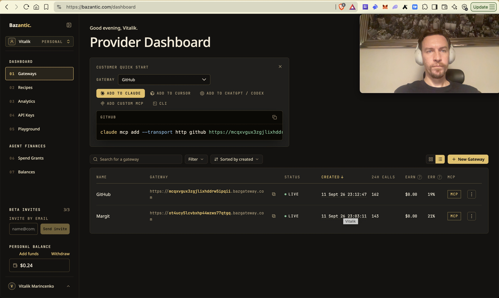

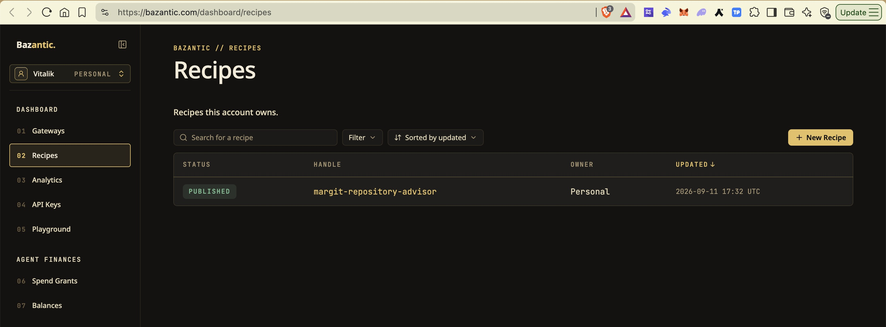

---

## Developer resources

| Resource | URL | Purpose |
| --- | --- | --- |
| Documentation | [docs.margit.sh](https://docs.margit.sh/) | API examples, authentication, wallets, payments, The Graph and Bazantic setup |
| API discovery | [api.margit.sh](https://api.margit.sh/) | Machine-readable endpoints and MCP client configuration |
| OpenAPI | [API&nbsp;specification](https://api.margit.sh/api/agent-docs/openapi.json) | Import into API clients and Bazantic's gateway form |

Documentation source: [docs page](public/docs/index.html). Existing `margit.sh/api/*` URLs remain supported.

---

## API Reference

| Endpoint | Method | Auth | Purpose |
|----------|--------|------|---------|
| `/api/auth/github/login` | GET | — | Start GitHub OAuth |
| `/api/auth/github/callback` | GET | — | OAuth callback, creates session |
| `/api/auth/logout` | POST | Session | Destroy session |
| `/api/auth/revoke` | POST | Session | Revoke the GitHub OAuth grant entirely |
| `/api/me` | GET | Session | Current user |
| `/api/repos` | GET | Session | List the signed-in user's GitHub repos |
| `/api/repos/make-private` | POST | Session | Convert a public repo to private |
| `/api/listings` | GET | Public | Browse the catalog |
| `/api/listings` | POST | Session | Create or update a listing, delivery terms, screenshots, cover and card color |
| `/api/listings/:id` | DELETE | Session | Unlist |
| `/api/listings/unlock` | GET | x402 (402-gated) | Agentic buy path — Circle Gateway settlement |
| `/api/checkout/quote` | POST | Buyer address | Validate delivery and issue buyer-bound quote |
| `/api/checkout/confirm` | POST | Private claim secret + tx hash | Verify receipt and recover original access |
| `/api/portfolio` | GET | Wallet signature / GitHub / operator session | Purchases, sales and Graph indexing status |
| `/api/access/:token/download.zip` | GET | Purchase access token | Download repository ZIP under the purchased delivery terms |
| `/api/access/:token/repo.git/*` | GET/POST | Purchase access token | Server-proxied Git clone/fetch |
| `/api/resolve-name` | GET | Public | ENS/ArcNS name → 0x address |
| `/api/resolve-address` | GET | Public | 0x address → ArcNS name (reverse) |
| `/api/keys` | POST | Session | Issue a margit API key |
| `/api/agent-api/repos` | GET | API key | List a seller's repos (external-agent surface) |
| `/api/agent-api/repos/list` | POST | API key | List a repo for sale (external-agent surface) |
| `/api/agent-api/repos/unlist` | POST | API key | Unlist a repo (external-agent surface) |
| `/api/agent/chat` | POST | Anonymous cookie | Agent sidebar conversation turn |
| `/api/agent/wallet` | GET/POST | Anonymous cookie | Preview wallet balances or select shared, personal, Circle, or 1Claw wallet |
| `/api/agent/settings` | GET/POST | Anonymous cookie | Per-visitor model + API key |
| `/api/agent/models` | GET | Public | Live OpenRouter model catalog (tool-calling capable) |
| `/api/repos/readme` | GET | Session | Fetch a repository README |
| `/api/repos/generate-description` | POST | Session | Generate listing copy from repository content |
| `/api/listings/:id/check-delivery` | POST | Public | Check repository delivery availability for wallet checkout |
| `/api/checkout/config` | GET | Public | Arc chain ID and configured checkout contract |
| `/api/checkout/price` | GET | Public | Listing price in an accepted checkout currency |
| `/api/portfolio/challenge` | POST | Public; nonce cookie | Issue a wallet sign-in challenge |
| `/api/portfolio/verify` | POST | Nonce cookie + wallet signature | Create a portfolio wallet session |
| `/api/portfolio/:id/access` | GET | Buyer wallet or agent session | Retrieve unexpired purchase access |
| `/api/portfolio/fees/prepare` | POST | GitHub session | Prepare publisher fee settlement |
| `/api/portfolio/fees/confirm` | POST | GitHub session + tx hash | Verify publisher fee payment |
| `/api/activity/leaderboards` | GET | Public | Graph-backed buyer and seller rankings |
| `/api/activity/bestsellers` | GET | Public | Graph-backed repository sales rankings |
| `/api/activity/recent-sales` | GET | Public | Recent indexed contract purchases |
| `/api/agent/gateway-balance` | GET | Public | Relay fresh Circle Gateway balance for a depositor address |
| `/api/agent/gateway-deposit` | POST | Anonymous cookie | Deposit an explicit amount from the selected wallet into Gateway |
| `/api/agent/circle/login` | POST | Anonymous cookie + consent | Start Circle email login |
| `/api/agent/circle/verify` | POST | Anonymous cookie + email code | Connect and select Circle wallet |
| `/api/agent/circle/disconnect` | POST | Anonymous cookie | Disconnect Circle and select demo wallet |
| `/api/agent/oneclaw/verify` | POST | Supplied 1Claw credentials | Verify signing address without storing credentials |
| `/api/agent/oneclaw/connect` | POST | Anonymous cookie + credentials + consent | Verify, store encrypted credentials and select 1Claw |
| `/api/agent/oneclaw/disconnect` | POST | Anonymous cookie | Remove 1Claw credentials and select demo wallet |
| `/api/recipe-advisor` | POST | Public; rate limited | Run the Bazantic repository advisor |
| `/api/mcp` | POST | Public tools; bearer API key for seller tools | Streamable HTTP MCP requests |
| `/api/agent-docs` | GET | Public | Agent connection details and tool discovery |
| `/api/agent-docs/skill` | GET | Public | Agent workflow instructions |
| `/api/agent-docs/openapi.json` | GET | Public | External-agent OpenAPI description |
| `/api/agent-docs/checkout-abi` | GET | Public | Checkout contract ABI |
| `/api/agent-docs/bazantic` | GET | Public | Bazantic registration guidance |


“Session” means GitHub sign-in; “Anonymous cookie” means the browser's separate agent session. For request examples and integration guides, see [docs.margit.sh](https://docs.margit.sh/).


---

## Project Structure

```text
margit/
├── src/                         # React frontend
│   ├── App.tsx                  # Routing, shared layout, and application state
│   ├── pages/                   # Home, catalog, listing details, My Repos, and portfolio
│   ├── components/              # Shared UI, agent chat, payments, and listing previews
│   ├── hooks/                   # Navigation and page interactions
│   ├── lib/                     # Wallet setup, formatting, and frontend helpers
│   ├── styles/                  # Page and component styles
│   └── api.ts                   # Typed backend requests and response models
├── server/src/                  # Hono API and backend services
│   ├── index.ts                 # Routes, authentication, and request validation
│   ├── listings.ts              # Repository listings and screenshot settings
│   ├── agent.ts                 # Chat agent and tool execution
│   ├── mcp.ts                   # MCP tools for external agents
│   ├── recipe-advisor.ts        # Bazantic repository recommendations
│   ├── graph.ts                 # The Graph activity and statistics queries
│   ├── checkout.ts              # Contract checkout orders and settlement
│   ├── payments.ts              # Arc payment verification
│   ├── x402-gateway.ts          # Circle Gateway x402 integration
│   ├── circle-*.ts              # Circle wallet and payment flows
│   ├── purchase-access.ts       # Purchased repository access and delivery
│   └── tests/                   # Backend regression tests
├── shared/                      # Shared payment, access-policy, and activity types
├── contracts/                   # MargitCheckout.sol, deployment records, and tests
├── subgraph/                    # The Graph schema, event mappings, and manifest
├── arc-track/README.md          # Arc integration, code references, and evidence
├── graph-track/README.md        # The Graph integration and verification
├── bazantic-track/README.md     # Bazantic gateways, Recipe, and verification
├── public/
│   ├── docs/                   # Static developer documentation
│   ├── skills/                 # Published instructions for agents
│   ├── site/                   # Shared visual assets and base styles
│   ├── images/                 # Marketplace illustrations
│   └── videos/                 # Homepage video assets
├── docs/                       # Deployment, payments, and integration guides
├── scripts/                    # Deployment, verification, and maintenance commands
├── api/index.ts                # Vercel entry point for the Hono API
├── vite.config.ts              # Frontend build, docs routing, and local API proxy
└── vercel.json                 # Production deployment and routing
```

---

## Security Model

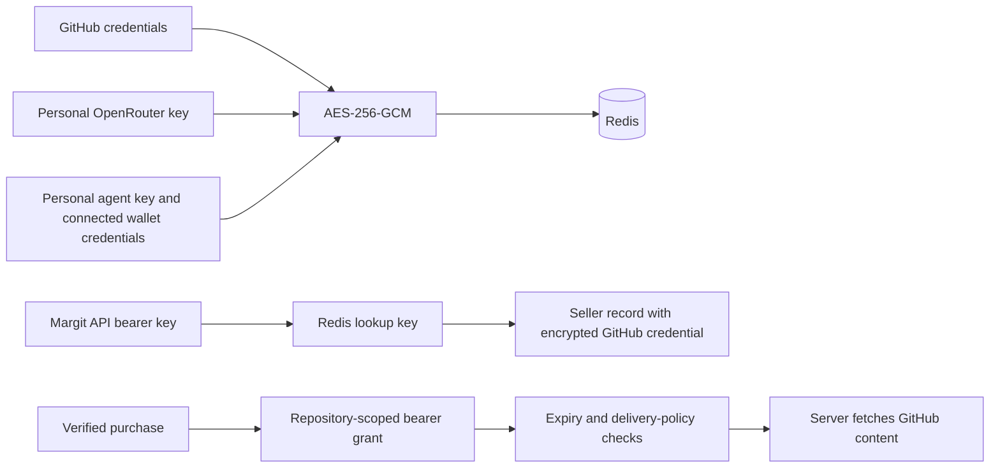

- **GitHub tokens** encrypted with AES-256-GCM before storage; the key lives only in `TOKEN_ENCRYPTION_KEY`.
- **Access URLs** contain repository-specific bearer grants, never the seller GitHub token. Grants expire and enforce the purchased delivery policy.
- **Contract order IDs are single-use onchain**. Receipt recovery is idempotent and never resets delivery expiry or download consumption.
- **Wallet keys never touch the server for human buyers** — the wallet SDK only ever handles signing in-browser.
- **The agent's own wallet key** (`ARC_DEMO_BUYER_PRIVATE_KEY`) is a real private key held server-side — fund it only with what you're willing to let the agent spend.
- **Personal OpenRouter keys, personal agent private keys, and connected wallet credentials** are encrypted at rest. Margit API bearer keys are currently Redis lookup keys; their associated GitHub credentials are encrypted. The bearer keys themselves are not encrypted or hashed in that lookup.
- **Payments are verified independently on-chain** (contract path via `viem` receipt decode; x402 path via the Circle Gateway facilitator) — the server never trusts a client's claim that it paid.

---

<div align="center">

**Built for ETHGlobal ETHOnline 2026** · USDC + EURC on Arc · agent-native by design

</div>
