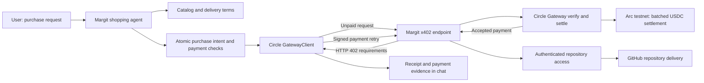

# Margit — Arc Details

Margit is a marketplace where humans and AI agents buy access to private GitHub repositories with stablecoins on Arc. The working product combines repository discovery, payment, seller fees, and authenticated repository delivery.

## Implementation and verification

1. Inspect the [recorded live payment evidence](../public/proofs/circle-arc-testnet.json).
2. Open the [Arc testnet Gateway deposit transaction](https://testnet.arcscan.app/tx/0xf4b2ccbe10bc27a8f2f563dcc2dace756775eb44546e9eafc9b105e02041386b).
3. Follow the app walkthrough below to inspect or repeat the payment flow.
4. Review the [payment implementation](../server/src/circle-payment.ts), [payment validation](../server/src/circle-agent.ts), and [mainnet readiness runbook](../docs/arc-mainnet-readiness.md).

## Verified payment

On **September 8, 2026 at 13:33:56 UTC**, Margit's Circle payment path purchased `vm06007/ai-summary` on **Arc testnet, chain ID 5042002**.

| Evidence | Observed result |
|---|---|
| Gateway funding | 0.20 testnet USDC deposited; onchain transaction linked above |
| Repository purchase | 0.05 USDC paid through x402 using Circle Gateway |
| Gateway response | Payment accepted; reference `5e3d30ab-110b-44b4-9bd2-f46565e7c821` |
| Repository delivery | HTTP 200, `application/x-git-upload-pack-advertisement` |
| Remaining Gateway balance after this test | 0.15 USDC; historical snapshot, not a live balance |
| Buyer | `0x1bA193f088e56041A680086ec422c60C43D5aaE5` |
| Seller | `0x641AD78BAca220C5BD28b51Ce8e0F495e85Fe689` |

**Receipt details:** the explorer transaction proves the Gateway deposit. The purchase returned a Gateway batch reference, not an individual onchain transaction hash. The JSON records the accepted payment and successful delivery observed by our test; its payment fingerprint is a local identifier, not an independent attestation. No access credentials or payment signatures are published.

The recorded test called the backend purchase function exposed to the model as `buy_listing_x402`. A subsequent purchase initiated through chat is linked below.

## Circle technology used

| Component | Integration in Margit | Source |
|---|---|---|
| Circle Nanopayments buyer | `GatewayClient` from `@circle-fin/x402-batching` 3.4.0; receives the 402 challenge, signs, and retries | [Buyer payment adapter](../server/src/circle-payment.ts) |
| Circle Gateway seller | `BatchFacilitatorClient` and `GatewayEvmScheme` verify and settle x402 payments | [Gateway setup](../server/src/x402-gateway.ts), [HTTP routes](../server/src/index.ts) |
| Arc and USDC | Arc testnet settlement and Gateway funding; USDC pays for repository access | [Live evidence](../public/proofs/circle-arc-testnet.json) |
| Agent decision and tools | Model browses listings, compares price and terms, checks funding, and invokes the payment tool | [Shopping agent](../server/src/agent.ts) |
| Payment visibility | Circle balance, one-click prompt suggestions, purchase requests, and receipt details | [Agent sidebar](../src/components/AgentSidebar.tsx) |
| External agent access | MCP tools, discovery documentation, and a published skill | [MCP server](../server/src/mcp.ts), [SKILL.md](../public/skills/margit/SKILL.md) |

[Circle's Arc Nanopayments reference app](https://github.com/circlefin/arc-nanopayments) uses the same buyer/payment SDK. Margit applies that payment flow to private repository commerce with Hono, Redis, and GitHub delivery. The reference app's UI, Supabase database, and framework are not required to use this SDK.

The agent can use the shared demo EOA or a personal EOA with its key encrypted by Margit. These wallets use the Circle Nanopayments SDK. Margit handles wallet selection, funding controls, and payment validation.

## Architecture



Margit also supports a separate contract checkout path with buyer-bound signed orders, atomic publisher payments, and a 0.5% fee. [Active checkout contract](https://testnet.arcscan.app/address/0x72c54ecd669acb19d6e6d5b5160f67d03b4d5b7b?tab=contract). Gateway x402 payments do not invoke that contract: their publisher fees accrue separately. See the [fee model](../docs/fee-model.md).

## Using the agent

For local setup, follow [Getting Started](../README.md#getting-started); the default frontend is `http://localhost:5173`.

1. Open **Catalog → Agent**. Circle purchases do not require GitHub sign-in.
2. Click **Find repositories** to compare available repositories and delivery terms without paying.
3. Click **Check Circle balance** to inspect the wallet and Gateway funding.
4. Click **Try Circle x402**. This sends the purchase request immediately.
5. The suggested purchase request includes a 0.10 USDC budget. To choose another budget, type a custom request instead; there is no hard-coded purchase cap or extra checkbox.
6. Inspect the Circle payment evidence card and returned repository access. An explorer link appears only if the payment response includes an actual transaction hash.
7. Open **View recorded test evidence** for the historical successful test, also served at `/proofs/circle-arc-testnet.json`.

A fresh paid run requires an available listing within budget, valid seller GitHub credentials, configured model access, and sufficient Gateway funds. The recorded access grant had a ten-minute window; the published evidence remains available, but it is not a permanent access link.

## Spending and retry controls

- No daily quota, fixed purchase cap, or additional authorization checkbox. The agent buys when requested and is instructed to respect any budget in the message.
- Exact network, token, seller, amount, and Gateway contract checked before signing; current listing terms checked again.
- Redis atomically reserves the buyer/listing intent before payment.
- An uncertain result after signing remains pending; the application does not automatically sign another payment.
- Repeating a completed user/listing purchase returns the original encrypted receipt and original access expiry, without another charge.
- No automatic wallet top-ups; no contract-payment fallback for a Circle request.

These controls apply to the Circle demo path. The older contract-buying agent tool still needs separate production hardening.

## Validation and readiness

```sh
node --import tsx --test server/tests/circle-payment.test.ts
npx tsc -p server/tsconfig.json
npm run build
```

Four payment tests passed: policy rejection, real SDK signing with mocked HTTP, stopping changed-price requests before signing, and refusing to treat an unpaid HTTP 200 as payment proof. The live payment above is separate from those mocked transport tests. Frontend build and TypeScript checks passed.

**Mainnet status:** the Arc testnet integration is working. Mainnet deployment and application cutover are pending. The [readiness assessment and unsigned deployment tooling](../docs/arc-mainnet-readiness.md) document the remaining release work.

Further material: [detailed Circle demo guide](../docs/circle-agent-demo.md), [Arc integration overview](../docs/arc-integration.md), [contract documentation](../contracts/README.md).

## Independent Circle receipt lookup

Receipt cards include **Verify payment on Circle**, linking directly to Circle's testnet API rather than Margit's stored evidence. For the subsequent user-triggered `patchdeck` purchase, [Circle's transfer receipt](https://gateway-api-testnet.circle.com/v1/x402/transfers/7d5d3d90-96db-414c-a7e7-560524f6bc33) independently returned matching buyer/seller addresses and `amount: "50000"` (0.05 USDC). At inspection it reported `status: "received"` and `txHash: null`; this proves Circle received the transfer, not that its batch has finalized onchain. Reopening the link retrieves the current status. If Circle returns a transaction hash later, it can be checked on the Arc testnet explorer.

## FAQ: why are x402 platform fees deferred?

Contract checkout collects our fee automatically. Circle x402 pays sellers directly, and we track the platform fee against their seller account for later settlement. This keeps the payment flow simple. New x402 purchases pause at 1.00 USDC in unpaid fees and resume once the balance is below that threshold.

The current Circle SDK integration has one payment recipient; we found no documented native marketplace commission split. We chose direct seller payments over adding platform custody and a payout service for the demo. This does not mean x402 cannot be extended with other settlement designs. Seller reputation is an incentive, not guaranteed collection. The backend pauses new x402 purchases at 1.00 USDC owed; a seller can still abandon the debt. See the [fee model, sources, alternatives, and suggested SDK enhancement](../docs/fee-model.md#why-this-model-and-how-it-compares-with-other-x402-integrations).
