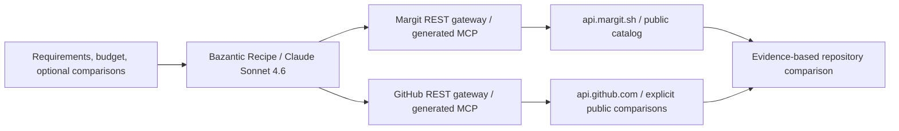

# Margit × Bazantic: Repository Advisor

Margit Repository Advisor turns repository discovery into a reusable workflow: compare marketplace offers against a user's requirements and budget, then enrich explicitly supplied public repositories with GitHub metadata. The result identifies supported matches, budget exclusions and evidence gaps without purchasing or claiming access.

**Published September 12, 2026**, confirmed in the owner's dashboard. Recipe handle: `margit-repository-advisor`.

- [Published Recipe dashboard](https://bazantic.com/dashboard/recipes/margit-repository-advisor) — may require sign-in.
- [Margit catalog](https://margit.sh/catalog)
- [Developer documentation](https://docs.margit.sh/)
- [Recipe prompt](recipe-prompt.md)

## Architecture

Margit supplies commercial context: current offers, USD prices, seller descriptions and available access policies. GitHub supplies public repository metadata, language byte counts and published releases. Public comparisons are optional; catalog repository names are not authorization to inspect private source.

## Live gateways

| | Margit | GitHub |
| --- | --- | --- |
| Dashboard | [Margit gateway](https://bazantic.com/gateways/ot4ucy5lcvbxhp44wzws77qtgq) | [GitHub gateway](https://bazantic.com/gateways/mcqxvgux3zgjlixhddrw5ipqii) |
| Upstream | `https://api.margit.sh` | `https://api.github.com` |
| Protocol / configured upstream auth | REST / No auth | REST / No auth |
| MCP endpoint | `https://ot4ucy5lcvbxhp44wzws77qtgq.bazgateway.com/mcp` | `https://mcqxvgux3zgjlixhddrw5ipqii.bazgateway.com/mcp` |
| Specification | [Margit OpenAPI](https://api.margit.sh/api/agent-docs/openapi.json) | [GitHub subset source](github-public.openapi.json) |

Configured resources at activation, each priced at **$0.01 per call**:

- Margit: `GET /api/listings`, `GET /api/checkout/config`, `POST /api/checkout/quote`, `POST /api/checkout/confirm`.
- GitHub: `GET /repos/{owner}/{repo}`, `GET /repos/{owner}/{repo}/languages`, `GET /repos/{owner}/{repo}/releases`.

The gateway's advertised tool list can be broader than the Recipe binding. The published Recipe binds exactly four tools: Margit `browse_catalog`; GitHub `github_get_repository`, `github_get_languages`, `github_list_releases`. It does not bind checkout, purchase, listing creation or unlisting tools.

Bazantic API usage charges are separate from Margit's repository purchase price and from Circle/Arc checkout. The Recipe's budget input limits the repository price, not total model, gateway or network costs. Configured prices are not proof that customer billing has been exercised.

## Inputs and behavior

| Input | Type | Constraints |
| --- | --- | --- |
| `requirements` | Text, required | 10–2,000 characters |
| `max_budget_usd` | Number, required | Minimum 0; repository purchase budget in USD |
| `comparison_repositories` | Text, optional | Maximum 500 characters; comma-separated `owner/repo`; inspect at most three unique entries |

Model used for the successful published configuration: **Claude Sonnet 4.6**. The prompt requests a short Markdown response, though combined test outputs sometimes used JSON. Outputs qualify seller claims, missing licenses, unknown access terms and metadata-only conclusions. Missing published releases are not proof of inactivity. A timed access policy is not evidence that downloaded code expires.

## Implementation work

Initial catalog responses included large screenshots and exceeded Bazantic's 32 KiB tool-result limit. [Catalog summarization](../server/src/catalog-summary.ts) now returns compact, paginated metadata on the API host: at most ten items per page, a 10,000-byte serialized item-array budget, descriptions capped at 400 characters, and explicit pagination/truncation information. Image payloads and unrelated fields are excluded. The tested five-listing response was about 1.5 KiB before MCP wrapping.

Sources:

- [API routes](../server/src/index.ts)
- [OpenAPI and discovery](../server/src/agent-docs.ts)
- [Compact catalog tests](../server/src/tests/catalog-summary.test.ts)
- [GitHub public API subset](github-public.openapi.json)
- [Public docs source](../public/docs/index.html)
- [Published Recipe prompt snapshot](recipe-prompt.md)

The prompt was simplified after repeated tests exposed unwanted GitHub lookups, contradictory budget labels and a timeout. Explicit comparison-only tool selection and a short output target improved the observed runs. Prompt instructions are not a deterministic authorization or budget enforcement layer.

## Verification and limitations

Evidence below comes from owner-supplied Bazantic dashboard test logs and publication screenshots on September 12, 2026. These are observed runs, not a reliability benchmark.

| Scenario | Configuration | Observed result |
| --- | --- | --- |
| Strict budget / no comparisons | TypeScript AI dependency-fix tool; budget $0.04; comparisons omitted; all four tools available | Completed in 18.814 s; only catalog called; Patchdeck at $0.05 consistently marked over budget and ineligible |
| Combined workflow | Same requirements; budget $50; explicit `vm06007/margit` comparison | Completed in 33.535 s; all four calls completed; catalog evidence linked to Margit; recommendation qualified as seller-described and unverified |
| Publication | Saved Recipe, then Publish | Dashboard displayed Unpublish and published read-only state |

Catalog data changes. The tested catalog contained five listings; the dependency-fix listing was $0.05. Future results should follow current data rather than assume those values.

What these runs do **not** establish:

- Paid customer invocation, settlement or billing: tests explicitly used Bazantic's operator credential with no payment.
- Inspection of private repository source, source quality, security or reuse permission.
- Guaranteed model compliance: earlier runs queried unrequested repositories, contradicted budget labels and timed out. The final configuration passed the listed cases, but private/missing explicit comparisons may still cause a runner-level failure.
- Public access to the authenticated dashboard, or prize eligibility for GitHub as a previously unlisted API.

A GitHub 404 can mean private, missing or inaccessible. This gateway uses no upstream credential. Do not inject a seller's GitHub or Margit secret into a shared public gateway to bypass that limitation.

## Reproduce

1. Open the Recipe dashboard in an authorized Bazantic account.
2. Inspect the four bound tools and the prompt snapshot.
3. Test requests both with and without comparison repositories.
4. Inspect actual tool calls, returned data and the recommendation together.
5. Save a successful output example and record the published state. Include the dashboard link and handle with the recording for reviewers.

## In-app integration

The Catalog now includes **Find with AI**. Its form posts requirements, a USD budget and optional public comparisons to Margit's `/api/recipe-advisor` backend. The backend calls the published Recipe as `tools/call` through the gateway returned by Bazantic MCP initialization:

`https://jtc64fcl6jbgzbohqrkfeu4may.bazgateway.com/recipe-mcp`

On September 12, 2026, a direct call to that published endpoint returned fresh advice without an authorization or payment header. This is actual Recipe execution, not the admin test API or a saved output example. It does not prove payment settlement or promise the endpoint will remain free. If Bazantic returns HTTP 402, Margit stops and displays payment-required information; it does not sign, pay, retry with a credential or silently switch models.

No Bazantic key is used by this integration. A web-app JWT is not required. Inputs are validated, the Recipe and destination are fixed server-side, and rate limiting uses Redis (one request per minute per IP and 60 total per hour). Service failures and timeouts appear as errors. Results support both Markdown and structured JSON because observed Recipe outputs vary.

Implementation: [backend](../server/src/recipe-advisor.ts), [Catalog form](../src/components/RepositoryAdvisor.tsx), [request/parser tests](../server/src/tests/recipe-advisor.test.ts). Runtime configuration uses the application's existing `APP_URL` and Redis configuration. The gateway URL is pinned to the verified discovery result; rediscover it if Bazantic migrates the Recipe gateway.

Validation: TypeScript, the Vite production build and four focused request/parser tests passed. A real request through the local app backend completed in 18.789 seconds, returned the published Recipe handle and fresh advice, and correctly marked the $0.05 listing over a $0.04 budget with comparisons omitted. No credential or payment header was sent. Production deployment and browser interaction verification remain pending.

### Main agent search preference

In the Margit Agent sidebar, open **⋮ → Search options → Use Bazantic advisor**.
The preference defaults to off and is remembered in this browser. When enabled,
the agent receives a `bazantic_repository_advisor` tool for project-fit and budget
recommendations. When disabled, that tool is omitted and execution is blocked.
The agent can call it once per turn, using the same validation, rate limits, and
no-payment behavior as the standalone modal. Results return to the conversation.
Try: “Find a TypeScript AI developer tool with a repository budget of $1.”
