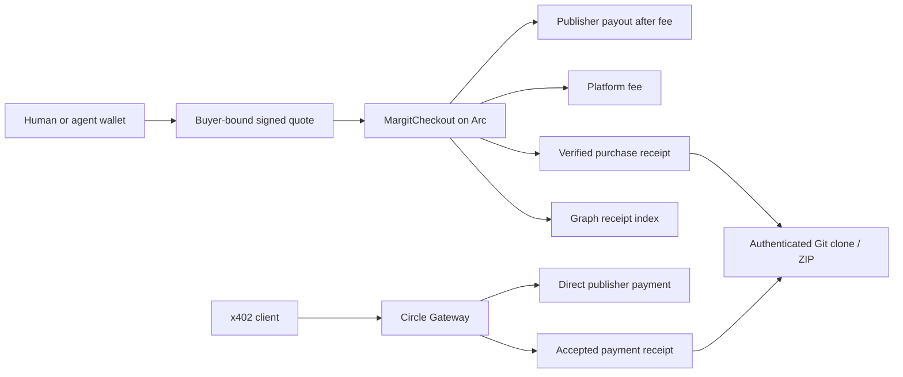

# Arc integration

Margit uses Arc for repository purchases and fee settlement. Buyers pay with USDC, EURC, or seller-enabled cirBTC, then receive an authenticated Git clone URL and ZIP download under the repository's access terms.

## Payment paths

Contract checkout uses buyer-bound signed orders. `MargitCheckout` verifies the order, pays the publisher, collects the 0.5% platform fee, and emits a receipt. Both payouts succeed together or the transaction reverts. The Graph indexes contract purchase and fee events.

Circle Gateway x402 pays the listed USDC price directly to the publisher. The built-in agent uses `GatewayClient` to handle the HTTP 402 challenge, sign the payment authorization, and retry the request. Publisher fees accrue separately. New x402 purchases pause once unpaid fees reach 1.00 USDC and resume when confirmed fee payments bring the balance below that amount.

## Currencies and access

USDC uses Arc's native currency for contract checkout and gas. EURC and cirBTC use ERC-20 transfers with approval when needed. Listing prices are denominated in USD; reference rates determine the quoted token amount. This conversion sets a checkout price and does not perform a token swap.

Orders bind the buyer, amount, deadline, and access terms. Confirmed purchases retain their original terms when a listing changes. The backend verifies payment before issuing access, and receipt recovery avoids charging again after an interrupted confirmation.

## Agent access

The built-in agent can browse listings, compare terms, check balances, and purchase repository access. It supports a shared demo wallet or a personal browser-linked wallet, faucet and connected-wallet funding, and deposits into Circle Gateway.

External agents can use seven MCP tools, the published skill, and OpenAPI documentation. Seller operations use scoped API keys. The `/agents` page provides connection examples and a live MCP connection check.

## Verification

- [Arc Details](../arc-track/README.md): tested payment flow, architecture, source links, and Circle receipts.
- [Recorded payment](../public/proofs/circle-arc-testnet.json): accepted 0.05 USDC purchase and successful repository delivery.
- [Contract documentation](../contracts/README.md): deployment, fee splitting, and receipt events.
- [Publisher fees](fee-model.md): deferred accounting, the debt threshold, and receipt recovery.
- [Circle agent integration](circle-agent-demo.md): wallet setup and payment controls.

## Deployment

The application runs on Arc testnet. Mainnet preparation includes an offline readiness assessment, configuration validation, unsigned deployment preparation, and release tests. Mainnet deployment and application cutover are pending; the [deployment runbook](arc-mainnet-readiness.md) covers configuration, state isolation, wallet custody, and rollback.

## Public subgraph

[MargitArc query playground](https://thegraph.com/explorer/subgraphs/DHMqTopWEHw2GuyFtwoGfH2Tizh1cskeiG7X6MTCk3Sn?view=Query) publishes the schema and deployment for reviewers. It indexes Arc testnet contract checkout and fee events, excluding Circle Gateway x402 purchases. The app uses its configured `GRAPH_QUERY_URL`; publishing does not automatically switch that endpoint. See the README verification section for a sample query and indexing status at verification.

The indexed events feed Catalog's **Recently sold** and **Catalog statistics**, the **Leaderboards** page (repository/buyer/seller rankings, currency volumes and activity chart), agent sales/ranking tools, and portfolio receipt enrichment. Aggregation and repository-name joins happen in the backend; the subgraph provides contract-event evidence. See [where the data is used and the reviewer walkthrough](../README.md#where-the-indexed-data-is-used) for the UI paths, API endpoints and sample GraphQL query.

See [The Graph Track Details](../graph-track/README.md) for the standalone subgraph integration and reviewer guide.
