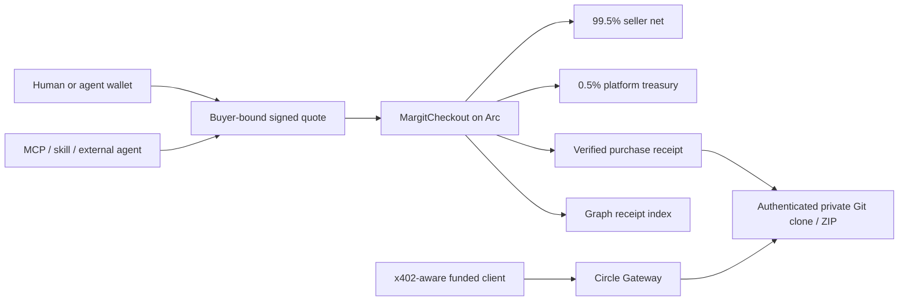

# Arc track submission and demo

## Primary bounty

**Launch on Arc Testnet & Push to Mainnet — $3,500 open track.** Margit is a commerce product with USDC/EURC checkout on Arc, onchain fee splitting, private GitHub delivery, and an agent-facing API/MCP. The supplied requirements allow deployment OR deployment readiness by September 30. State the status accurately: testnet MVP live, mainnet deployment kit prepared, remaining release gates documented.

The separate $1,500 Continuity version requires Continuity eligibility. Do not claim that track without registration. Best DeFi/Onchain Finance is a possible secondary fit because of commerce settlement and programmable fee flows. The Agentic Economy prize specifically emphasizes Circle Agent Stack: the present OpenRouter/Thirdweb/MCP agent integration is NOT by itself evidence of Circle Agent Stack usage.

## Evidence map

| Requirement | Present evidence | Submission work |
| --- | --- | --- |
| Working frontend + backend | Catalog, seller form, wallet checkout, portfolio, delivery, MCP at `/agents` | Record a fresh live demo and provide deployment URL |
| Meaningful Arc/USDC | Arc native USDC gas, buyer-bound contract purchase, atomic 0.5% publisher fee | Show transaction, seller net, treasury fee, and receipt |
| EURC commerce | USD/EUR reference conversion, approval then contract purchase | Demo actual EURC payment; identify the reference-rate assumption |
| Programmable flows | Signed amount/buyer/deadline/terms, replay protection, atomic fee split, idempotent receipt recovery | Show one rejected replay/expired quote and recovery without another payment |
| Agent integration | Seven MCP tools, SKILL.md, OpenAPI, external seller keys; built-in funded test wallet | Show clear user intent → catalog selection → quote → wallet payment → delivery |
| Circle technology | Arc, USDC/EURC, Circle Gateway x402 testnet path | Distinguish Thirdweb wallet integration from Circle Wallets; do not claim CCTP, StableFX, App Kits, Paymaster or Agent Stack integrations that are not implemented |
| Architecture | Existing README diagrams + settlement diagram below | Include in slides/video |
| Mainnet readiness | `arc:readiness`, unsigned deployment preparation, release tests and runbook | Finish app network cutover and production sign-off by September 30 |
| Video + presentation | Demo outline below | Record video and export slides; these artifacts are not yet produced |
| Source | https://github.com/vm06007/margit | Provide reviewed commit and setup commands |

The 99.5/0.5 split describes contract checkout. Gateway x402 pays the full listed price to the seller and records a separately settled publisher fee. Explain the distinction in the demo.

## Three-minute demo outline

- **0:00–0:25:** Problem: agents can discover code but need a way to pay and receive authorized private access. Show catalog and seller-selected terms.
- **0:25–1:15:** Buy with USDC on Arc; show the transaction, native USDC gas, publisher net and treasury fee. Clone/download using the returned credential without exposing it on camera.
- **1:15–1:45:** Show EURC price conversion and checkout, or one short pre-recorded successful transaction. Explain that reference conversion is not an onchain FX swap.
- **1:45–2:20:** Open `/agents`, test MCP, show SKILL.md, browse through an external agent and prepare a quote. If demonstrating payment, the authorized wallet signs and the server confirms it.
- **2:20–2:40:** Demonstrate a failure guard or receipt recovery; explain that delivery terms survive listing edits.
- **2:40–3:00:** Show architecture and mainnet plan, list remaining release gates and September 30 target. Do not replace a blocked readiness result with a “mainnet live” claim.

## Highest-value improvements

1. **Finish production network/custody separation.** A real launch configuration and isolated wallet/state are more persuasive than adding another token or logo.
2. **Enforce agent spending policy in code.** Per-user wallets, transaction/daily limits, quote-price ceilings, allowlists, explicit user authorization and durable concurrent reservations tie reasoning to bounded real spending.
3. **Add Circle Agent Stack only for the relevant prize.** Implement a concrete wallet/payment operation with the official stack and show the resulting receipt; update diagrams and claims after it works.
4. **Prove settlement reliability.** Show retry-safe confirmation, mismatched buyer/chain rejection, exact token precision and recovery after seller GitHub reconnection.
5. **Record measured evidence.** Capture real transaction hashes, settlement timing and fees. Do not invent benchmarks. Link to the explorer and source verification.
6. **Consider Gateway unified balance/CCTP only if it solves onboarding.** It is valuable when a buyer funds Arc from another chain; it should be a tested customer flow, not a checkbox. Confirm network support first.
