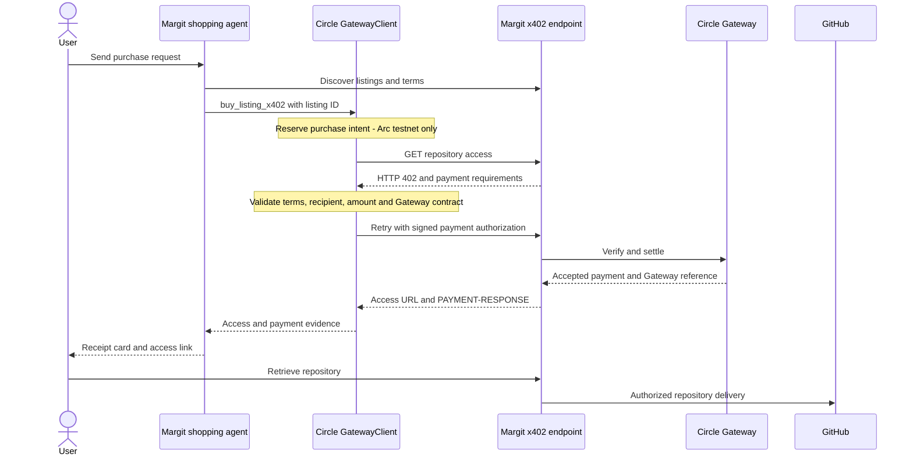

# Circle Gateway agent demo on Arc testnet

Margit's built-in shopping agent can pay for repository access with Circle Nanopayments using `@circle-fin/x402-batching` 3.4.0. The buyer uses `GatewayClient`; the seller uses `BatchFacilitatorClient` and `GatewayEvmScheme`. This x402 payment path is separate from MargitCheckout contract purchases.

The signer can be the funded shared demo EOA or a personal EOA whose key is stored encrypted by Margit. The implementation uses the same buyer/payment SDK as [Circle's Arc Nanopayments reference](https://github.com/circlefin/arc-nanopayments), with a Hono backend, Redis storage, and GitHub repository delivery.

## Verified test, September 8, 2026

- Deposited 0.20 testnet USDC into Circle Gateway.
- [Deposit transaction](https://testnet.arcscan.app/tx/0xf4b2ccbe10bc27a8f2f563dcc2dace756775eb44546e9eafc9b105e02041386b).
- Purchased `vm06007/ai-summary` for 0.05 USDC through the actual x402 endpoint and Circle Gateway.
- Gateway accepted the payment and returned reference `5e3d30ab-110b-44b4-9bd2-f46565e7c821`.
- Repository delivery returned HTTP 200 with `application/x-git-upload-pack-advertisement`.
- Public evidence: `/proofs/circle-arc-testnet.json`. This contains no private keys, signatures, or access credentials.

The deposit transaction is onchain funding evidence. The Gateway reference identifies the accepted batched payment; it is not an individual transaction hash. The UI only creates a transaction explorer link when a valid transaction hash was actually returned. The payment fingerprint is a local SHA-256 identifier, not an independent attestation.

## Demo in the app

1. Open the agent from Catalog. GitHub sign-in is needed for seller tools, not Circle purchases.
2. Click **Find repositories** or **Check Circle balance**. Clicking a suggestion sends its request immediately.
3. Click **Try Circle x402**. This immediately sends the suggested purchase request. To use different instructions or a budget, type a custom message instead.
4. The model browses listings and calls `buy_listing_x402`; the server validates the payment independently.
5. Inspect the payment evidence card and repository access. No contract-checkout fallback is permitted for a Circle request.

The recorded test called the same backend purchase function used by the model tool. The subsequent chat-initiated purchase has a Circle receipt linked below.

## Controls and limits

- Arc testnet only; USDC only. There is no fixed purchase cap, daily quota, or extra authorization checkbox.
- Ask the agent to purchase in chat. Prompt suggestions can include a budget; edit it as needed.
- GitHub sign-in is not required for buying with the demo wallet. Buyer intents are scoped to the chat session and selected wallet.
- Redis atomically reserves the user/listing purchase intent before signing to prevent duplicate payment.
- The SDK hook checks amount, asset, chain, seller, Gateway verifying contract, and current listing terms before signing.
- Completed access receipts are encrypted in Redis. Repeating the same user/listing purchase returns the original receipt, including its original expiry; it does not renew access or charge again.
- An uncertain result after signing retains a pending intent. Do not delete it or re-sign until payment and delivery are reconciled.
- No automatic deposits or top-ups. Funding is an operator action.

These controls apply to the new Circle demo path. The older contract-buying tool still uses the shared demo EOA and needs separate hardening before production use. Circle documents its own agent-wallet spending policies as mainnet-only, so these testnet controls are enforced by Margit.

## Validation

`node --import tsx --test server/tests/circle-payment.test.ts`

Tests use the actual Circle SDK with mocked HTTP to check signing, pre-sign validation, and rejection of an unpaid response as payment proof. Live evidence is separately recorded above.

References: [Circle buyer quickstart](https://developers.circle.com/gateway/nanopayments/quickstarts/buyer), [supported networks](https://developers.circle.com/gateway/references/supported-blockchains), [wallet policy limitations](https://developers.circle.com/agent-stack/agent-wallets/wallet-operations/custom-policies).

## Independent Circle receipt lookup

Receipt cards include **Verify payment on Circle**, linking directly to Circle's testnet API rather than Margit's stored evidence. For the subsequent user-triggered `patchdeck` purchase, [Circle's transfer receipt](https://gateway-api-testnet.circle.com/v1/x402/transfers/7d5d3d90-96db-414c-a7e7-560524f6bc33) independently returned matching buyer/seller addresses and `amount: "50000"` (0.05 USDC). At inspection it reported `status: "received"` and `txHash: null`; this proves Circle received the transfer, not that its batch has finalized onchain. Reopening the link retrieves the current status. If Circle returns a transaction hash later, it can be checked on the Arc testnet explorer.

## Shared and personal agent wallets

The sidebar defaults to the funded shared demo EOA. **My agent wallet** creates a separate EOA on first use and restores it on subsequent selections. Its key is encrypted server-side with the app's token encryption key and is scoped to the browser's HTTP-only agent session cookie (one year). Clearing that cookie loses access to the personal wallet; these are testnet demo wallets, not Circle-managed Agent Wallets. Switching wallets also separates model conversation history and payment receipts by wallet.

Open the information panel to copy the selected address and open https://faucet.circle.com/. Select **USDC / Arc Testnet**. Alternatively, connect a wallet using the navigation and use **Fund from connected wallet** to transfer native testnet USDC to the agent address. This opens the connected wallet's transaction flow.

Once funded, enter an amount and choose **Add to x402 Gateway**, or send the explicit chat command `/gateway 1` to deposit 1 USDC. This uses the selected wallet's Circle SDK `deposit` operation. A 0.01 USDC gas reserve is required. The returned transaction links to Arc explorer; Gateway indexing can lag briefly. Balances refresh every 15 seconds while open, on focus, and after chat actions. The shared Gateway balance was topped up to 10 USDC on September 8; the UI always displays live balances.

Deposit requests are serialized per signing address and saved with an idempotency receipt. An uncertain submission remains locked for operator review rather than automatically issuing another transfer. No additional deposits are made by switching modes, viewing balances, or creating a wallet.
