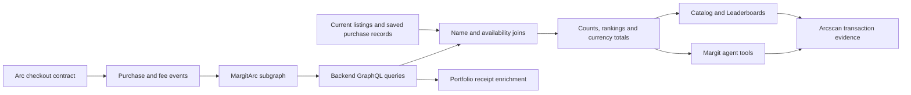

# Margit: The Graph Details

Margit is a marketplace where humans and AI agents discover and buy access to private GitHub repositories. The Graph supplies indexed contract activity for sales discovery, wallet and repository rankings, and transaction evidence. These features let users and agents compare actual purchase activity alongside current listing prices and access terms.

## Public subgraph and implementation

- **[MargitArc — public Graph Explorer and query playground](https://thegraph.com/explorer/subgraphs/DHMqTopWEHw2GuyFtwoGfH2Tizh1cskeiG7X6MTCk3Sn?view=Query)**
- Subgraph ID: `DHMqTopWEHw2GuyFtwoGfH2Tizh1cskeiG7X6MTCk3Sn`; published version `v0.4.0`.
- Indexed chain: **Arc testnet**, chain ID **5042002**. Publication is on The Graph's Arbitrum One network; the indexed transactions are on Arc.
- [Checkout contract](https://testnet.arcscan.app/address/0x72c54ecd669acb19d6e6d5b5160f67d03b4d5b7b?tab=contract).
- [Subgraph manifest](../subgraph/subgraph.yaml), [entity schema](../subgraph/schema.graphql), and [event mappings](../subgraph/src/mapping.ts).
- [Backend Graph queries](../server/src/graph.ts), [ranking calculations](../shared/graphLeaderboard.ts), and [agent tools](../server/src/agent.ts).

The application uses its configured `GRAPH_QUERY_URL`. Publishing the subgraph does not change that endpoint automatically. The earlier September 11, 2026 public Explorer check reported an indexing/availability issue while the configured Studio endpoint returned data. See [endpoint configuration and the recorded verification status](../README.md#verify-the-graph-integration). Public-network query availability must be checked before switching endpoints; publication alone is not evidence that queries succeed.

## Features powered by The Graph

| Product surface | Indexed data and user benefit | Implementation |
| --- | --- | --- |
| Catalog: Recently sold | Shows purchase amounts, times and transaction evidence; currently available listings appear first | [Sales card](../src/components/RecentGraphSales.tsx) |
| Catalog: Catalog statistics | Counts purchases, sold repositories and distinct buyer/seller wallets; links to detailed statistics | [Statistics card](../src/components/MarketStatsCard.tsx) |
| Leaderboards | Ranks repositories, buyers and sellers by purchase count; includes distinct counterparties, separate currency volumes, daily activity and period filters | [Leaderboards page](../src/pages/LeaderboardsPage.tsx) |
| Shopping agent | Answers recent-sales, bestseller and market-activity questions using tool results rather than invented popularity scores | [Agent](../server/src/agent.ts), [suggested requests](../src/lib/agentSuggestions.ts) |
| Portfolio | Supplements application purchase records with indexed contract receipt and fee information | [Portfolio](../server/src/portfolio.ts), [Graph queries](../server/src/graph.ts) |

## Architecture



The subgraph stores immutable event entities. Ranking and period aggregation run in Margit's backend. Repository names and descriptions are not indexed: the backend joins listing hashes with application records. Missing names remain **Listing no longer in catalog**, rather than an invented repository identity.

## Indexed entities

| Entity | Recorded information |
| --- | --- |
| `Purchase` | Purchase/listing identifiers, buyer, seller, token, amount, terms hash, transaction hash and timestamp |
| `PurchaseFee` | Purchase identifier, token, treasury, platform fee, seller amount, transaction hash and timestamp |
| `DeferredFeePayment` | Seller identifier, payer, amount, transaction hash and timestamp for deferred fee settlement |

Deferred fee settlements can be indexed when they emit contract events. That does **not** mean individual Circle Gateway x402 purchases are indexed. Sales rankings use `Purchase` events from contract checkout.

## Reviewer walkthrough

1. Open the [public subgraph](https://thegraph.com/explorer/subgraphs/DHMqTopWEHw2GuyFtwoGfH2Tizh1cskeiG7X6MTCk3Sn?view=Query) to inspect its deployment and schema.
2. Start Margit using [Getting Started](../README.md#getting-started), then open `/catalog`. Inspect **Catalog statistics** and **Recently sold**.
3. Follow **View all statistics** to `/leaderboards`. Switch among **Top repos**, **Top buyers** and **Top sellers**; try **Last 7 days** and **Last 30 days**.
4. Inspect **View source data**, the indexed block and a **Verify** transaction link. Compare an event's buyer, seller and amount with Arcscan.
5. Open the agent and try **Bestselling repos**, **Top buyers**, **Top sellers**, or **Weekly statistics**. These are read-only discovery requests. Buying is a separate user-requested action.
6. Run the GraphQL query below against an available endpoint and compare events with the application output.

```graphql
{
  _meta { block { number } hasIndexingErrors }
  purchases(first: 20, orderBy: timestamp, orderDirection: desc) {
    id
    purchaseId
    listingId
    buyer
    seller
    token
    amount
    transactionHash
    timestamp
  }
}
```

Amounts in the subgraph are token base units. Margit formats known currencies using their token decimals. A fresh backend check on September 11, 2026 returned **8 purchases, 2 distinct buyers, 2 distinct sellers and 3 listing identifiers**, with **3.09 USDC** gross volume, indexed through block **61,513,236**. This is a historical observed snapshot from the configured endpoint, not a guarantee of current results or a separate signed attestation.

## Agent tools and application APIs

| Agent tool | HTTP API | Purpose |
| --- | --- | --- |
| `recent_graph_sales` | `GET /api/activity/recent-sales` | Latest 20 indexed sales |
| `graph_bestsellers` | `GET /api/activity/bestsellers` | Repository popularity by indexed purchase count |
| `graph_leaderboards` | `GET /api/activity/leaderboards?period=all` | Buyer/seller/repository rankings and statistics; period also accepts `7d` or `30d` |

The agent combines indexed activity with current catalog information for price, language and availability. The Graph does not authorize spending, manage GitHub visibility, or deliver source code. Those responsibilities remain in Margit's payment and access tools.

## Coverage and validation

- Sales statistics cover **Arc testnet contract checkout**, excluding individual Circle Gateway x402 purchases.
- Rankings examine at most the latest **1,000 indexed purchase events**. A capped sample is disclosed; it must not be described as unlimited all-time activity. Period filters operate on that sample.
- Duplicate event IDs are counted once. Wallet addresses are normalized for distinct counts; wallets are not verified human identities.
- Rankings use purchase count, then distinct counterparties. Purchase activity is not a review, quality rating or Sybil-resistant reputation score.
- Gross volumes remain separate by currency and use integer arithmetic. They are not seller net proceeds or a combined USD valuation.
- Indexed-block provenance and transaction links support inspection. An unavailable service produces an unavailable state, not fabricated statistics.
- Tests: [leaderboard aggregation](../server/tests/graph-leaderboard.test.ts) and [bestseller ranking](../server/tests/graph-bestsellers.test.ts).

For the separate Circle payment integration, see [Arc Details](../arc-track/README.md). For fee semantics and repository delivery limits, see [fee accounting](../docs/fee-model.md) and the [main README](../README.md).
